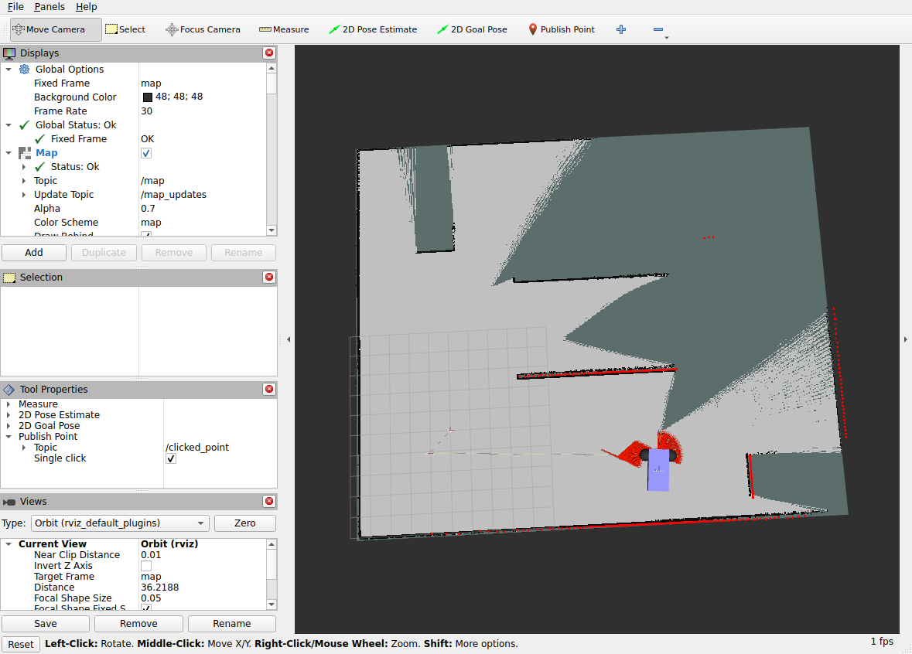

# ros2-gazebo-robot-lab

基于 Docker 的 ROS 2 Lyrical 与 Gazebo 小车探索实验。当前实验采用 **360° 扫描 → AI 选择方向 → 行驶该方向激光量程的一半 → 再扫描**，连续循环；传统探索与 Nav2 在此模式暂停。

## 当前主实验：AI 连续扫描与移动

入口 `scripts/robot-scan-drive.sh --wall-budget 1800`。一次动作结束后自动开始下一次扫描，不按单轮退出。直行目标速度 0.6 m/s，旋转目标速度 0.8 rad/s；本轮代码冻结，运行中只记录结果。此模式是明确启用的无碰撞检查 Gazebo 实验，启动方法、数据定义和边界见[完整说明](docs/scan-drive-experiment-2026-10-06.md)。

此前两阶段代码及修正保留为独立模式，当前连续实验不加载这些探索与保护链。下面为此前实现记录，不能与本次实验数据混用。

## 2026-10-06 代码更新：持续调查与两阶段探索

本次将模型从每轮候选选择扩展为持续调查：传统探索先独立运行，交接后由 AI 围绕同一个调查对象连续查看地图、查询路线、导航、读取反馈和记录证据。

- **MCP 调查接口**：新增在线地图图像与坐标转换、异步搜索/规划、坐标及途经点导航、调查创建/结束和任务取消。
- **统一车体与保护参数**：车体轮廓、误差余量、传感器外参、速度与制动参数集中到车辆契约；导航和保护共用参数并检查运行时一致性。
- **整场状态与交接**：新入口取消三动作上限，采用时间、距离与失败预算；连续低收益、重复无进展或完整补查无目标时交接，第一次空候选不等于探索完成。
- **失败记忆与防振荡**：保存失败原因、接近方式和进展；允许换方向和必要旧路中转，抑制无进展重复往返。

**验证状态：已按后续授权执行回归测试和真实 ROS/Gazebo 仿真。** 当前结果、启动故障与能力边界见[本轮运行记录](docs/runtime-consolidation-2026-10-06.md)。途经点采用逐段 Nav2 导航与停稳复核；不能将接口测试通过当作整屋探索或接触脱困通过。

[完整更改说明与限制](docs/persistent-investigation-implementation-2026-10-06.md) · [新流程入口](workspace/robot_agent/run_investigation.py) · [车辆契约](workspace/navigation_base/config/robot_contract.yaml)

### 追加第 3 项：低速试探与短退脱困

新增 `probe_forward` 与 `recover_short_reverse` MCP 技能。底层以 0.04 m/s 执行 5–20 cm 试探或最多 20 cm 短退；保留完整车体、最新地图/扫描检查和 Nav2 碰撞保护。符合条件的失败先确认停车，再沿最近直线轨迹尝试一次短退，取得新观测并查询新路线。每场/每处/每个失败来源限制恢复次数；恢复成功不等于探索进展，也不会自动反复前进顶推。

[查看低速试探与短退更改记录](docs/protected-short-motion-2026-10-06.md)。该文记录前次提交；本轮测试及运行结果以最新整理记录为准。

### 当前入口与本轮修正

旧的 `model-loop` / `classical-loop` / 单步运动试验入口已移除。使用 `scripts/robot-investigate.sh` 启动两阶段系统；`scripts/robot-skills.sh` 仅用于状态、停止和操作员管理。新建空白地图可先显式执行 `scripts/initialize-exploration-map.sh`，仅进行受保护的初始化扫描并停车；初始化观测与后续探索分别记账。

新增短退距离递减、短步仿真时间判定、默认 30% AI 资源预留、严格的受阻证据筛选，以及基于 odometry 的扫描运动补偿。另提供不发运动指令的停车证据记录器，区分输入异常与几何碰撞拒绝。[查看完整更改及能力边界](docs/runtime-consolidation-2026-10-06.md)。接触后脱困和 State Lattice 尚未实现。用户另行授权了默认关闭的临时 Gazebo 碰撞保护暂停模式；该模式的数据单独标记，不算正常保护模式验收。

## 系统改进方案

[导航、实时保护与探索决策重构方案](docs/navigation-exploration-redesign-2026-10-05.md)：统一车体与运动参数，以 Nav2 负责规划、控制和有界恢复，独立实时监控负责保护，异步任务接口连接 Frontier 与模型高层决策。方案包含权限边界、代码迁移顺序和通道/探索验收；设计仍是整体目标；本次已提交上述四项及第 3 项恢复技能代码，运行配置与验收状态以更改说明为准。

## 实验结果

[2026-10-05 日结：时间标定、有限视野探索、路径阈值与人工引导接管](docs/experiments/2026-10-05/README.md) · [最新接管试验](docs/experiments/2026-10-05/operator-junction-autonomy/README.md) · [走廊穿越问题分析](docs/experiments/2026-10-05/operator-junction-autonomy/corridor-analysis.md)


最新试验先人工辅助到指定中转点附近，再交回模型：**自主导航 1 个目标成功、行驶 5.11 m，随后模型主动停车**。当时仍有可执行的 5.50 m 中转路径；模型认为远端整条路线 22.41 m 超过剩余 14.89 m 的实验距离预算，因此停止。自主地图窗口净变化 **+3.45 m²**，受地图配准/定位变化影响，可比较收益为 `null`。本次没有继续穿过左侧路口，不能声称完成持续扩图或整屋探索。

当天还完成时间回放、候选诊断、Frontier 簇关联及离线防循环验收，并进行了 4.5 m 搜索范围、有限视野建图和车体精确几何检查试验。默认路径净空 2.15 m；用户授权的可选 1.48 m 实验最多 3 个目标，独立实时 guard 仍为 1.9 m。人工辅助单独记账，不计作自主探索成果。

历史记录：

[2026-10-04 日结：进展、问题、实跑与下一步](docs/experiments/2026-10-04/README.md) · [最新运行数据](docs/experiments/2026-10-04/evidence/memory-trial-summary.json)



2026-10-04 最新 `memory` 模式实跑：**2/2 目标成功，行驶 4.03 m，最近雷达 2.51 m，停车确认通过**。已知地图面积从 **256.90 增至 288.33 m²**，净增加 **31.43 m²**；第二步存在非整数地图配准变化，已排除出可信收益趋势。剩余约 40 s 仿真时间不足以容纳最短候选估计的 53.4 s，故没有发出第三个目标。不是整屋覆盖率，也不是重置起点后的策略对照；本轮未触发低收益防循环过滤。

[原始地图前后对照](docs/experiments/2026-10-04/images/memory-map-progression.png) · [Gazebo 实际场景](docs/experiments/2026-10-04/images/memory-trial-gazebo.png) · [完整实验与问题清单](docs/experiments/2026-10-04/README.md)

历史记录：[10 月 3 日激进/保守单次对照](docs/experiments/2026-10-03/frontier-comparison/README.md) · [Frontier 首轮](docs/experiments/2026-10-03/frontier/README.md) · [后续路线](docs/robot-skills-roadmap.md) · [运行说明](docs/frontier-exploration.md)。旧图与原始记录保留；不能将不同初始地图下的结果直接比较为模型提升。

以下链接记录旧版本验证：[整条路径间距检查](docs/guard-path-clearance.md)、[移动或观察设计](docs/move-or-observe-design.md)、[六工具候选选择](docs/robot-skills-mcp.md)、[有界连续探索](docs/bounded-exploration-agent.md)、[区域探索](docs/regional-exploration.md)。其中的三轮限制、模型只选候选 ID、独立 1.9 m 径向 guard 与旧命令不代表当前两阶段系统。

## 验证进度（含历史版本）

下列已完成项是历史验证记录；新系统的当前代码、入口和未验收范围见上方更新说明及[主运行路径整理记录](docs/runtime-consolidation-2026-10-06.md)。

- [x] Docker 仿真环境与持久化目录
- [x] 小车前进、转向、停止
- [x] `/model/vehicle/odometry` 运动反馈
- [x] 修复 `robot_state_publisher` 模型解析错误
- [x] TF 与 RViz 机器人、里程计显示
- [x] GTX 1650 上 Docker 内 NVIDIA OpenGL 硬件渲染与运动回归
- [x] 2D 激光雷达、`/scan` 桥接、固定 TF 与 RViz 扫描显示
- [x] SLAM Toolbox 接入、`/map`、完整 TF 与短程建图验证
- [ ] 整屋覆盖与回环质量验收
- [x] Nav2 静态场景单目标导航：穿通道、绕墙、墙内目标拒绝及失败后继续导航
- [ ] 动态障碍与卡住恢复专项验收
- [x] Frontier 第一版：实时地图自主选点，4 个目标实测成功并自动停车
- [x] 激进/保守选点单次对照：共同时间已知面积增加约 31%，激进版 7/8 目标成功
- [x] 路径与 guard 间距评估、地图/路径变化重查、受阻目标排除及回归测试
- [x] OpenAI/MCP 六工具、受限候选选择、幂等、任务仲裁与停车确认
- [x] 有界连续 Frontier、可选观察接口、区域地图变化账本
- [x] 探索记忆模式及两目标在线验收，成功换视角并新增已知地图
- [x] 动作时间回放、Frontier 簇关联与离线防循环针对性验收
- [ ] 低收益循环的在线触发、走廊穿越持续目标与公平策略对照
- [ ] Frontier 整屋探索与覆盖率验收

本项目已验证静态场景中的建图与单目标导航，已跑通自主选点执行循环，尚未完成整屋自主探索和动态场景鲁棒性验收。2026-10-02 已在 **NVIDIA GeForce GTX 1650** 上验证 Docker 内硬件 OpenGL 渲染，Gazebo 与 RViz 正常显示，运动、里程计、关节状态和 TF 回归通过。

## 验证环境与前提

已在 Ubuntu 26.04、x86_64、ROS 2 Lyrical、Gazebo Sim 10.5.0 的本地桌面环境验证。需要 Docker、可用的 X11/XWayland 桌面和宿主机 `xauth`。

**当前启动脚本使用 `--gpus all` 与 `--device /dev/dri:/dev/dri`，需要 NVIDIA GPU、NVIDIA Container Toolkit 和宿主机可用的 `/dev/dri`。** 已验证 GPU 为 GTX 1650，驱动为 595.91.07，容器内 `glxinfo -B` 报告 NVIDIA OpenGL 4.6。当前 GUI 为兼容 NVIDIA/Xwayland 使用 Mesa 软件渲染，服务端与 GPU LiDAR 保留 NVIDIA 加速。尚未验证无 NVIDIA 主机、Windows/macOS 或纯无头环境。镜像基础标签和 apt 包未锁定版本，未来重新构建的依赖可能变化。

## 首次使用

```bash
git clone https://github.com/huam54925-cpu/ros2-gazebo-robot-lab.git
cd ros2-gazebo-robot-lab

docker build -t robot-sim:lyrical-v1 -f docker/Dockerfile .
./docker/prepare-display.sh
./docker/start-navigation-base.sh
```

若缺少宿主机 `xauth`，Ubuntu 可安装 `sudo apt install xauth`。在当前图形桌面的终端执行显示准备脚本；重新登录桌面后可能需要再次执行。不要在仿真运行过程中刷新授权文件。

脚本自动按仓库位置定位挂载目录，克隆到移动硬盘也可使用。此台机器原项目位置为 `/mnt/robot_disk/ros_sim`。镜像本体通过 Docker 构建，不存进 Git。

启动后会打开 Gazebo 与 RViz，并自动运行物理仿真。节点使用仿真时间。关闭 Gazebo GUI 不会停止独立的服务端；在启动终端按 Ctrl+C，或执行：

```bash
docker stop robot-sim-gui
```

容器自动删除，本地 `home/` 与 `workspace/` 保留。

## 控制与验证

下面的自动验证会让**仿真小车短暂前进和转向，然后停止**：

```bash
docker exec robot-sim-gui bash -lc \
  'source /opt/ros/lyrical/setup.bash; python3 /work/robot_ws/navigation_base/verify_motion.py'
```

输出包括位移、转角、停止速度、关节名、TF 查询结果和 `passed`。2026-10-02 硬件渲染回归得到 `passed: true`，前进 0.3922 m、转向 0.6369 rad、停止速度为 `[0.0, 0.0]`。测试使用固定墙钟时长，仿真运行速度会影响位移，结果不应解释为实时性能测试。

检查容器内渲染器：

```bash
docker exec robot-sim-gui glxinfo -B
nvidia-smi
```

本机验证中 vendor 为 `NVIDIA Corporation`，renderer 为 `NVIDIA GeForce GTX 1650/PCIe/SSE2`，宿主机 GPU 进程列表出现 `gz-sim-gui-client`。RViz 启动日志报告 OpenGL 4.5；该版本号本身不用于判断渲染器厂商。

持续读取里程计：

```bash
docker exec -it robot-sim-gui bash -lc \
  'source /opt/ros/lyrical/setup.bash; ros2 topic echo /model/vehicle/odometry'
```

速度话题是 `/model/vehicle/cmd_vel`，消息类型 `geometry_msgs/msg/Twist`；停止命令为全部分量置零。

## 2D 激光雷达

小车的 `gpu_lidar` 配置为 360°、360 个水平采样点、10 Hz 仿真时间更新率、量程 0.1–12 m。world 显式加载 Physics、UserCommands、SceneBroadcaster 和 Sensors；传感器使用 Ogre2，GUI 保留 OGRE。前方静态测试墙带有 visual 和 collision，用于检查测距。

`/scan` 以 `sensor_msgs/msg/LaserScan` 单向桥接 Gazebo→ROS，消息坐标为 `vehicle/lidar`。已保存的 RViz 配置启用 LaserScan，采用 Best Effort、Volatile、Points（3 像素），Fixed Frame 为 `vehicle/odom`。

仿真运行时可检查：

```bash
docker exec robot-sim-gui bash -lc \
  'source /opt/ros/lyrical/setup.bash; ros2 topic hz /scan'
docker exec robot-sim-gui bash -lc \
  'source /opt/ros/lyrical/setup.bash; ros2 topic echo /scan --once --field ranges --qos-reliability best_effort'
```

频率命令持续运行，用 Ctrl+C 结束。本机已观察到连续扫描、约 3.70–4.93 m 的墙面有效回波和 RViz 扫描点；实际接收频率约 3.8–4.5 Hz。该接收频率不等于已验证的 10 Hz 仿真时间频率，实时因子与实时性能尚未测量。加入雷达后运动回归继续通过。

## 坐标关系与修复

```text
vehicle/odom
└── vehicle/base_link
    └── vehicle/chassis
        ├── vehicle/left_wheel
        ├── vehicle/right_wheel
        ├── vehicle/caster
        └── vehicle/lidar
```

雷达安装位置为车体坐标下 `[0, 0, 0.4]`，`static_transform_publisher` 发布 `vehicle/chassis → vehicle/lidar` 固定 TF。

DiffDrive 提供唯一里程计与第一段 TF；`robot_state_publisher` 使用关节状态发布车体内部 TF。速度命令先经过 `velocity_guard`，其安全输出桥接到 Gazebo；其余反馈仅 Gazebo→ROS，避免重复发布。超过 0.5 秒无新速度指令、雷达过期或障碍进入 1.9 m 范围时自动停车。

ROS 描述副本去除解析插件不支持的模型级 `<pose>`；Gazebo 物理模型保留自己的位置。球形后轮在 ROS 描述里用固定关节显示，在物理仿真中仍为球关节。DiffDrive 的参考点为驱动轮轴中心；`base_link` 取该点的地面投影，`base_link → chassis` 固定平移为 `[-0.7057095, 0, 0.5]` m。已与 Gazebo 真实运动对照验证，见 `docs/indoor-mapping.md`。KDL 根链接惯量警告目前仍存在，但模型初始化和 TF 验证已通过。

详见 [配置说明](workspace/navigation_base/README.md) 和 [验证记录](docs/validation.md)。

## 文件结构

- `docker/`：Dockerfile、显示准备、启动脚本。
- `workspace/navigation_base/`：启动文件、模型、场景、RViz 与验证脚本。
- `docs/`：验证结果。
- `third_party/`：上游来源与许可文本。
- `gui/`、`home/`、`logs/`、`data/`：本地运行目录，不上传。

## 上游来源

模型、场景和 RViz 配置源自 [ros_gz_sim_demos](https://github.com/gazebosim/ros_gz/tree/ros2/ros_gz_sim_demos)，遵循 Apache-2.0；原始副本、修改说明与许可文本随仓库保留。详见 [上游说明](third_party/README.md)。

## 独立室内建图场景

新增 24×20 m 围墙、宽通道与三个不对称障碍物，原单墙雷达测试场景保留。参见 [室内场景与建图组件准备](docs/indoor-mapping.md)。已接通 SLAM，支持 RViz 地图显示与地图保存；短程闭合路线测试通过，整屋覆盖及回环质量仍待验收。

当前显示兼容设置：Gazebo GUI 和 RViz 使用 Mesa 软件渲染以避免 NVIDIA/Xwayland 黑屏，服务端及 GPU LiDAR 保留 NVIDIA 加速。详见室内建图文档的显示与停车修复记录。


## Nav2 定点导航

已加入独立导航镜像与 `docker/start-nav2.sh`，在当前 SLAM 地图上运行 Smac 2D + Regulated Pure Pursuit。导航速度仍经原停车保护处理。配置、单目标命令和实际测试结果见 [Nav2 说明](docs/nav2-navigation.md)。软件与数据继续保存在数据盘，不安装宿主机 ROS 软件包。
