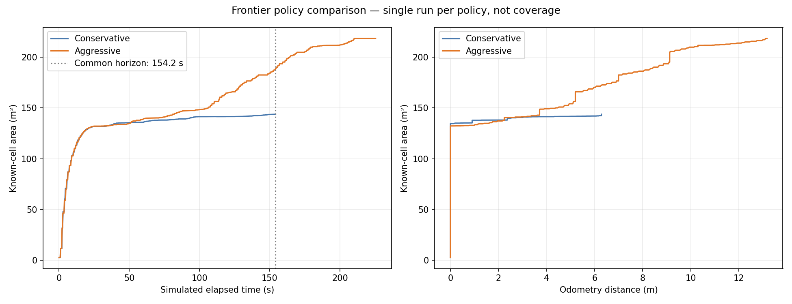

# ros2-gazebo-robot-lab

基于 Docker 的 ROS 2 Lyrical 与 Gazebo 小车仿真实验：速度控制、里程计反馈、TF 和 RViz 可视化，已接入 2D 激光雷达、SLAM Toolbox 建图和 Nav2，并完成静态室内单目标导航实测。

## 实验结果

[2026-10-03 日结与明天计划](docs/experiments/2026-10-03/daily-summary.md)

[2026-10-03 实验记录、图片与原始数据](docs/experiments/2026-10-03/README.md) · [后续路线与技能接口设计](docs/robot-skills-roadmap.md)



蓝色为保守策略，橙色为激进策略。左图按仿真时间、右图按里程计距离比较已知地图面积。共同仿真时长约 154 秒时，激进版已知面积增加约 **31%**；扣除初始旋转后，每米导航新增面积约为保守版的 **3.43 倍**。两策略各运行一次，已知面积不等于覆盖率；激进版 7/8 目标成功，最后一段触发停车保护后取消。

[激进/保守策略实测对照](docs/experiments/2026-10-03/frontier-comparison/README.md) · [Frontier 首轮结果与图片](docs/experiments/2026-10-03/frontier/README.md) · [运行说明](docs/frontier-exploration.md)

## 当前进度

- [x] Docker 仿真环境与持久化目录
- [x] 小车前进、转向、停止
- [x] `/model/vehicle/odometry` 运动反馈
- [x] 修复 `robot_state_publisher` 模型解析错误
- [x] TF 与 RViz 机器人、里程计显示
- [x] GTX 1650 上 Docker 内 NVIDIA OpenGL 硬件渲染与运动回归
- [x] 2D 激光雷达、`/scan` 桥接、固定 TF 与 RViz 扫描显示
- [x] SLAM Toolbox 接入、`/map`、完整 TF 与短程建图验证
- [ ] 整屋覆盖与回环质量验收
- [x] Nav2 静态场景单目标导航：穿通道、绕墙、墙内目标拒绝及失败后继续导航
- [ ] 动态障碍与卡住恢复专项验收
- [x] Frontier 第一版：实时地图自主选点，4 个目标实测成功并自动停车
- [x] 激进/保守选点单次对照：共同时间已知面积增加约 31%，激进版 7/8 目标成功
- [ ] Frontier 整屋探索与覆盖率验收

本项目已验证静态场景中的建图与单目标导航，已跑通自主选点执行循环，尚未完成整屋自主探索和动态场景鲁棒性验收。2026-10-02 已在 **NVIDIA GeForce GTX 1650** 上验证 Docker 内硬件 OpenGL 渲染，Gazebo 与 RViz 正常显示，运动、里程计、关节状态和 TF 回归通过。

## 验证环境与前提

已在 Ubuntu 26.04、x86_64、ROS 2 Lyrical、Gazebo Sim 10.5.0 的本地桌面环境验证。需要 Docker、可用的 X11/XWayland 桌面和宿主机 `xauth`。

**当前启动脚本使用 `--gpus all` 与 `--device /dev/dri:/dev/dri`，需要 NVIDIA GPU、NVIDIA Container Toolkit 和宿主机可用的 `/dev/dri`。** 已验证 GPU 为 GTX 1650，驱动为 595.91.07，容器内 `glxinfo -B` 报告 NVIDIA OpenGL 4.6；脚本不再设置 `LIBGL_ALWAYS_SOFTWARE=1`。 尚未验证无 NVIDIA 主机、Windows/macOS 或纯无头环境。镜像基础标签和 apt 包未锁定版本，未来重新构建的依赖可能变化。

## 首次使用

```bash
git clone https://github.com/huam54925-cpu/ros2-gazebo-robot-lab.git
cd ros2-gazebo-robot-lab

docker build -t robot-sim:lyrical-v1 -f docker/Dockerfile .
./docker/prepare-display.sh
./docker/start-navigation-base.sh
```

若缺少宿主机 `xauth`，Ubuntu 可安装 `sudo apt install xauth`。在当前图形桌面的终端执行显示准备脚本；重新登录桌面后可能需要再次执行。不要在仿真运行过程中刷新授权文件。

脚本自动按仓库位置定位挂载目录，克隆到移动硬盘也可使用。此台机器原项目位置为 `/mnt/robot_disk/ros_sim`。镜像本体通过 Docker 构建，不存进 Git。

启动后会打开 Gazebo 与 RViz，并自动运行物理仿真。节点使用仿真时间。关闭 Gazebo GUI 不会停止独立的服务端；在启动终端按 Ctrl+C，或执行：

```bash
docker stop robot-sim-gui
```

容器自动删除，本地 `home/` 与 `workspace/` 保留。

## 控制与验证

下面的自动验证会让**仿真小车短暂前进和转向，然后停止**：

```bash
docker exec robot-sim-gui bash -lc \
  'source /opt/ros/lyrical/setup.bash; python3 /work/robot_ws/navigation_base/verify_motion.py'
```

输出包括位移、转角、停止速度、关节名、TF 查询结果和 `passed`。2026-10-02 硬件渲染回归得到 `passed: true`，前进 0.3922 m、转向 0.6369 rad、停止速度为 `[0.0, 0.0]`。测试使用固定墙钟时长，仿真运行速度会影响位移，结果不应解释为实时性能测试。

检查容器内渲染器：

```bash
docker exec robot-sim-gui glxinfo -B
nvidia-smi
```

本机验证中 vendor 为 `NVIDIA Corporation`，renderer 为 `NVIDIA GeForce GTX 1650/PCIe/SSE2`，宿主机 GPU 进程列表出现 `gz-sim-gui-client`。RViz 启动日志报告 OpenGL 4.5；该版本号本身不用于判断渲染器厂商。

持续读取里程计：

```bash
docker exec -it robot-sim-gui bash -lc \
  'source /opt/ros/lyrical/setup.bash; ros2 topic echo /model/vehicle/odometry'
```

速度话题是 `/model/vehicle/cmd_vel`，消息类型 `geometry_msgs/msg/Twist`；停止命令为全部分量置零。

## 2D 激光雷达

小车的 `gpu_lidar` 配置为 360°、360 个水平采样点、10 Hz 仿真时间更新率、量程 0.1–12 m。world 显式加载 Physics、UserCommands、SceneBroadcaster 和 Sensors；传感器使用 Ogre2，GUI 保留 OGRE。前方静态测试墙带有 visual 和 collision，用于检查测距。

`/scan` 以 `sensor_msgs/msg/LaserScan` 单向桥接 Gazebo→ROS，消息坐标为 `vehicle/lidar`。已保存的 RViz 配置启用 LaserScan，采用 Best Effort、Volatile、Points（3 像素），Fixed Frame 为 `vehicle/odom`。

仿真运行时可检查：

```bash
docker exec robot-sim-gui bash -lc \
  'source /opt/ros/lyrical/setup.bash; ros2 topic hz /scan'
docker exec robot-sim-gui bash -lc \
  'source /opt/ros/lyrical/setup.bash; ros2 topic echo /scan --once --field ranges --qos-reliability best_effort'
```

频率命令持续运行，用 Ctrl+C 结束。本机已观察到连续扫描、约 3.70–4.93 m 的墙面有效回波和 RViz 扫描点；实际接收频率约 3.8–4.5 Hz。该接收频率不等于已验证的 10 Hz 仿真时间频率，实时因子与实时性能尚未测量。加入雷达后运动回归继续通过。

## 坐标关系与修复

```text
vehicle/odom
└── vehicle/base_link
    └── vehicle/chassis
        ├── vehicle/left_wheel
        ├── vehicle/right_wheel
        ├── vehicle/caster
        └── vehicle/lidar
```

雷达安装位置为车体坐标下 `[0, 0, 0.4]`，`static_transform_publisher` 发布 `vehicle/chassis → vehicle/lidar` 固定 TF。

DiffDrive 提供唯一里程计与第一段 TF；`robot_state_publisher` 使用关节状态发布车体内部 TF。速度命令先经过 `velocity_guard`，其安全输出桥接到 Gazebo；其余反馈仅 Gazebo→ROS，避免重复发布。超过 0.5 秒无新速度指令、雷达过期或障碍进入 1.9 m 范围时自动停车。

ROS 描述副本去除解析插件不支持的模型级 `<pose>`；Gazebo 物理模型保留自己的位置。球形后轮在 ROS 描述里用固定关节显示，在物理仿真中仍为球关节。DiffDrive 的参考点为驱动轮轴中心；`base_link` 取该点的地面投影，`base_link → chassis` 固定平移为 `[-0.7057095, 0, 0.5]` m。已与 Gazebo 真实运动对照验证，见 `docs/indoor-mapping.md`。KDL 根链接惯量警告目前仍存在，但模型初始化和 TF 验证已通过。

详见 [配置说明](workspace/navigation_base/README.md) 和 [验证记录](docs/validation.md)。

## 文件结构

- `docker/`：Dockerfile、显示准备、启动脚本。
- `workspace/navigation_base/`：启动文件、模型、场景、RViz 与验证脚本。
- `docs/`：验证结果。
- `third_party/`：上游来源与许可文本。
- `gui/`、`home/`、`logs/`、`data/`：本地运行目录，不上传。

## 上游来源

模型、场景和 RViz 配置源自 [ros_gz_sim_demos](https://github.com/gazebosim/ros_gz/tree/ros2/ros_gz_sim_demos)，遵循 Apache-2.0；原始副本、修改说明与许可文本随仓库保留。详见 [上游说明](third_party/README.md)。

## 独立室内建图场景

新增 24×20 m 围墙、宽通道与三个不对称障碍物，原单墙雷达测试场景保留。参见 [室内场景与建图组件准备](docs/indoor-mapping.md)。已接通 SLAM，支持 RViz 地图显示与地图保存；短程闭合路线测试通过，整屋覆盖及回环质量仍待验收。

当前显示兼容设置：Gazebo GUI 和 RViz 使用 Mesa 软件渲染以避免 NVIDIA/Xwayland 黑屏，服务端及 GPU LiDAR 保留 NVIDIA 加速。详见室内建图文档的显示与停车修复记录。


## Nav2 定点导航

已加入独立导航镜像与 `docker/start-nav2.sh`，在当前 SLAM 地图上运行 Smac 2D + Regulated Pure Pursuit。导航速度仍经原停车保护处理。配置、单目标命令和实际测试结果见 [Nav2 说明](docs/nav2-navigation.md)。软件与数据继续保存在数据盘，不安装宿主机 ROS 软件包。
