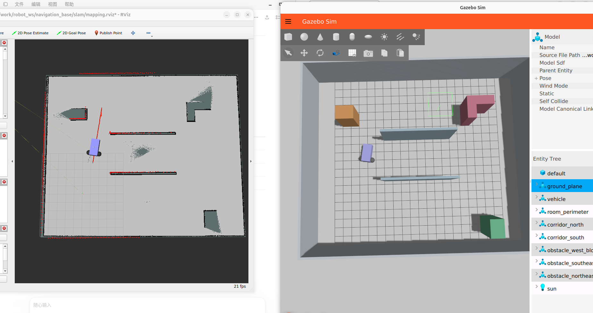
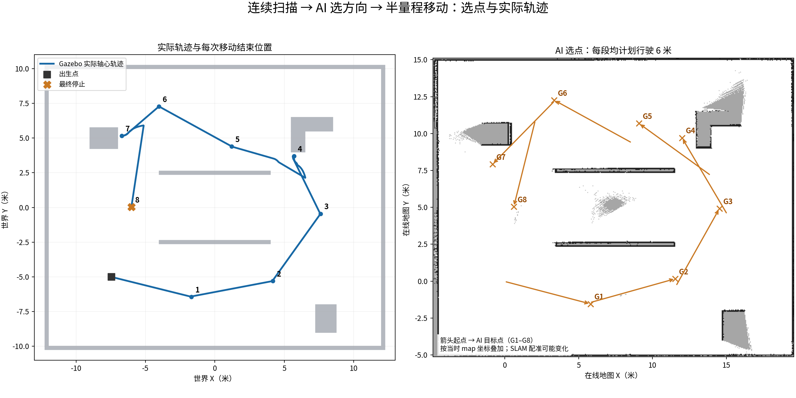

# Robot Exploration 2.0

**从出生点扫描四周 → AI 选择方向 → 行驶该方向量程的一半 → 再扫描，连续执行。** 这是本仓库后续开发主线；传统探索器、Nav2 任务调度、旧调查/恢复链和重复保护程序已从主线移除。

本轮基线运行取得 9 次扫描、8 次移动和可复核的真实世界轨迹。固定参考区域覆盖估计从首圈扫描后的 **25.64% 增至 97.25%**；第 4、7 步揭示了里程计“完成”与实际移动不足的问题。这些结果作为 2.0 的起始证据保留，而非完整通行或无碰撞验收。

- [2.0 架构、挂载选项和开发方向](docs/v2-design.md)
- [本次数据、选点轨迹与总结对比](docs/experiments/2026-10-06/v2-scan-drive/README.md)
- [完整旧版分支 archive/pre-v2-2026-10-06](https://github.com/huam54925-cpu/ros2-gazebo-robot-lab/tree/archive/pre-v2-2026-10-06)

## 最新运行证据 · 2026-10-06



**实际界面。** 用户选定的本次截图：左侧为 RViz 在线建图，右侧为 Gazebo 场景与车辆位置，展示本轮连续探索后的观测结果。



**数据证据。** 左侧是记录得到的 Gazebo 实际轴心轨迹，右侧是 AI 提交的 8 个目标点；两侧坐标系分别标注。目标点与实际到达应分开判断，完整数据和误差分析见[本次实验记录](docs/experiments/2026-10-06/v2-scan-drive/README.md)。

## 运行

当前实现用于 ROS 2 Lyrical / Gazebo 的 Docker 仿真。Docker、NVIDIA 图形环境和 X11 可用后，构建环境：

```bash
docker build -t robot-sim:lyrical-v1 -f docker/Dockerfile .
docker build -t robot-sim:lyrical-mapping-v2 -f docker/Dockerfile.mapping .
scripts/setup-agent-env.sh
# 在本地 .env 填写 OPENAI_API_KEY 和 OPENAI_MODEL；不要提交 .env。
docker/prepare-display.sh
```

三个终端依次执行，等待仿真与 SLAM 就绪：

```bash
# off：不加载任何避障、碰撞、地图或车体通行约束
ROBOT_SAFETY_MOUNT=off docker/start-navigation-base.sh mapping
# 终端 2
docker/start-slam.sh
# 终端 3：默认连续运行 1800 墙钟秒
scripts/robot-scan-drive.sh --wall-budget 1800
```

可使用 `ROBOT_HEADLESS=true` 启动无界面模式。停止探索：`scripts/stop-scan-drive.sh`；最终报告的 `stopped` 和速度反馈用于确认停车。仿真进程可保留用于查看地图。

## 可选安全挂载

| 启动设置 | 行为 |
|---|---|
| `ROBOT_SAFETY_MOUNT=off` | 不导入、不调用碰撞约束模块，复现本次直接执行方式 |
| `ROBOT_SAFETY_MOUNT=on` | 挂载独立、精简的激光车体扫掠检查，无 Nav2 或旧保护链 |
| `ROBOT_SAFETY_MOUNT=auto`（默认） | 根据运行环境自动决定；当前 Gazebo 环境解析为 `off` |

解析结果固定于本场任务，并写入报告与每次动作。AI 决策和执行器读取同一结果，不在移动过程中暗中切换。改变选项需要下一次启动容器；旧容器不热切换。`off` 保留任务期限、用户停止和动作完成停车，它们是运行生命周期控制；Gazebo 物理碰撞仍然存在。当前不提供实车驱动。

## 验证

```bash
.venv-agent/bin/python -m unittest discover -s workspace/robot_agent -p test_scan_drive.py -v
.venv-agent/bin/python -m unittest discover -s workspace/robot_agent -p test_environment.py -v
# 使用有 NumPy 的 Python（ROS 容器内也可运行）
python3 -m unittest discover -s workspace/robot_agent -p test_safety_mode.py -v
PYTHONPATH=workspace python3 -m unittest discover -s workspace/navigation_base/tests -v
```

可选 `on` 模块已做离线逻辑测试，尚未做整场挂载仿真。本次整理没有重新驱动车辆。旧版代码、旧教程和历史实验源快照见存档分支；`docs/experiments/` 内历史数据保留为证据，不是当前运行入口。
