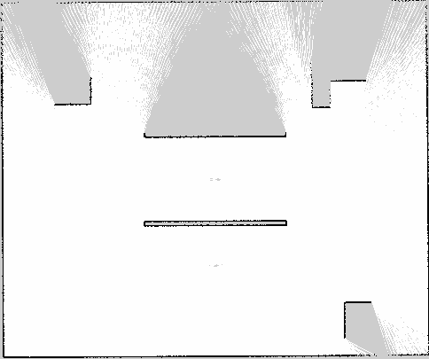
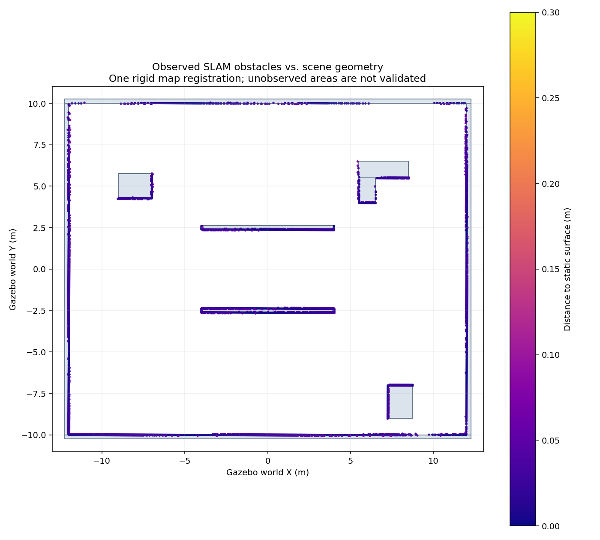
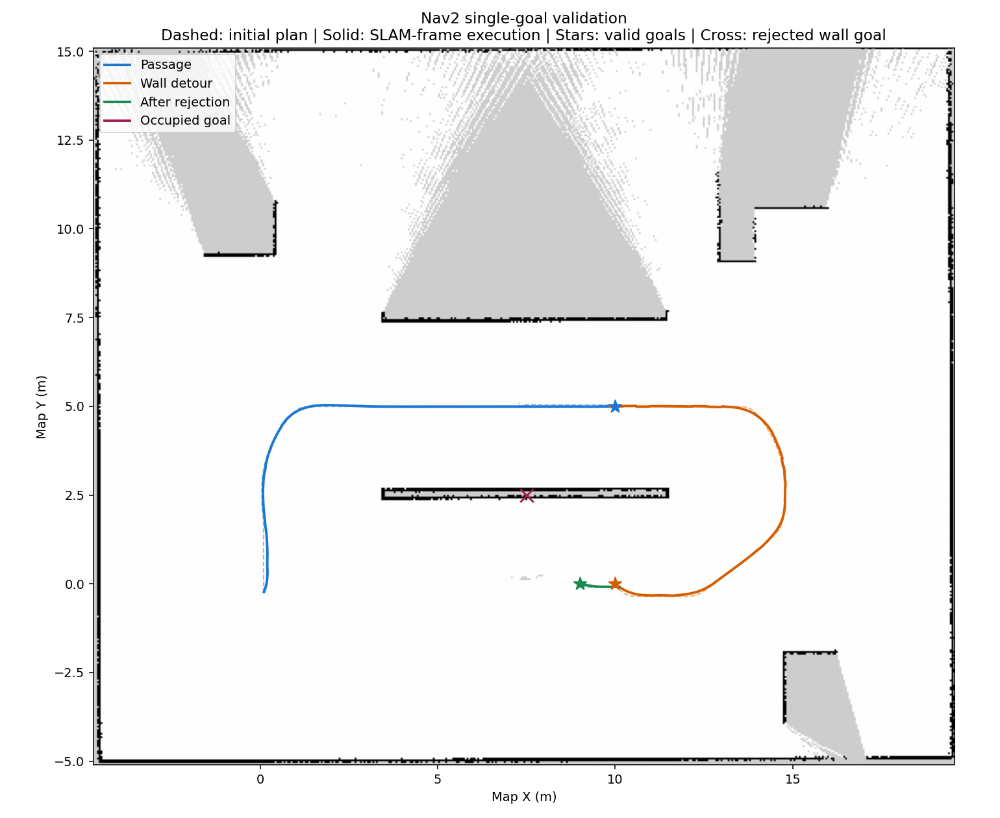
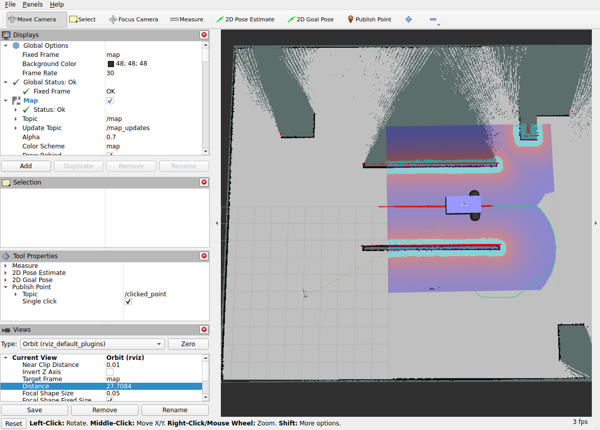

# 2026-10-03：二维 SLAM 与 Nav2 实验记录

本次完成闭合路线建图、已观测障碍几何校验，以及静态室内 Nav2 单目标导航。这里归档筛选后的原始 JSON、地图和图片；不是重新运行产生的数据。制品来源与 SHA-256 见 [manifest.json](manifest.json)。

## 验收范围

| 项目 | 状态 | 边界 |
|---|---|---|
| M1：二维 SLAM 闭合路线建图与几何校验 | 通过 | 未单独确认回环约束触发；未验收整屋覆盖和自由空间正确性 |
| M2：Nav2 静态室内单目标导航 | 通过 | 穿通道、绕隔墙、墙内目标拒绝、拒绝后继续导航 |
| 动态障碍与卡住恢复 | 未验收 | 成功导航 recovery 次数为零，不证明恢复动作有效 |
| Frontier / 信息增益 / LLM 技能层 | 尚未实现 | 见[后续设计](../../robot-skills-roadmap.md) |

## SLAM：约 38 m 闭合路线

白色为空闲，黑色为障碍，灰色为未知。北侧隔墙和障碍背面仍有遮挡。地图框内已知格比例不能直接称为可探索区域覆盖率。

| 指标 | 数值 |
|---|---:|
| 墙钟耗时 | 724.7 s |
| 已知栅格 | 13,086 → 150,885 |
| 地图尺寸 / 分辨率 | 484×405 / 0.05 m |
| 真实起终点距离 | 0.230 m |
| SLAM 地图起终点距离 | 0.248 m |
| 真实起终点朝向差绝对值 | 0.808° |
| 最小观测雷达间距 | 2.194 m |

机器人没有精确回到原位置，因此 0.230 m 与 0.248 m **不是两种定位误差**。初始朝向对齐后，两种坐标中起终点位移的差约 0.018 m；这只是静止端点对照，不是全轨迹精度测量。控制使用里程计，Gazebo 真值仅用于评估。

[原始路线结果](data/indoor-loop-20261003.json) · [地图 YAML](data/indoor-loop-20261003.yaml) · [地图 PGM](data/indoor-loop-20261003.pgm)

### 已观测障碍几何校验

将已观测 occupied cells 与 Gazebo 静态障碍表面比较。允许一次整体刚体配准：平移约 (-7.4657,-5.0000) m、旋转 -0.344°。名义坐标对齐时 95 分位距离为 0.118 m；配准后如下：

| 指标 | 结果 |
|---|---:|
| 表面距离中位数 | 0.020 m |
| 表面距离 95 分位 | 0.047 m |
| 15 cm 内的已观测障碍格比例 | 100% |

这些结果只支持已观测障碍的几何对齐，不证明未知区域、自由空间和地图拓扑全部正确，也不是定位精度结论。地图栅格并非独立样本，本轮没有做多次重复实验或置信区间评估。

[质量原始数据](data/indoor-loop-20261003.quality.json)

### TF 修正证据

DiffDrive 的轮轴参考点曾误标为车身中心，导致约 90° 转弯时车身位移误差约 0.99 m。增加正确的 `base_link → chassis` 偏移后，同类转向测试中车身 TF 位移误差约 5.3 mm。该结论来自停车后的分阶段真值对照。

[修正前](data/motion-before.json) · [修正后](data/motion-after.json)

## Nav2：只给终点，自行规划和执行

虚线为初始规划，实线为 SLAM 坐标中的实际执行轨迹；星号为有效目标，叉号为墙内非法目标。每次只发送一个终点和朝向，没有向 Nav2 提供中间航点，也没有向规划器提供 Gazebo 真值。

| 测试 | 初始规划长度 | 结果 | 到点位置误差 | 耗时 |
|---|---:|---|---:|---:|
| 穿通道 | 14.43 m | SUCCEEDED | 0.145 m | 163.5 s |
| 绕隔墙 | 13.14 m | SUCCEEDED | 0.147 m | 150.5 s |
| 墙内目标 | 无路径 | ABORTED / GOAL_OCCUPIED (206) | 不适用 | 6.5 s |
| 拒绝后继续导航 | 1.14 m | SUCCEEDED | 0.143 m | 21.1 s |

三次有效目标均停稳，方向误差分别为 1.68°、4.07°、4.44°，位置误差符合配置的 0.15 m 目标容差附近。墙内目标真值位移为 0，规划与导航都返回 206。最小观测雷达间距不低于 2.338 m；未停用或降低原 1.9 m 保护阈值。

所有案例 recovery 次数均为 0：验证了失败处理和后续可用性，**尚未验证卡住后的 Spin/BackUp 等恢复行为**。绕障对象为已知静态隔墙，没有验证动态障碍突然出现。

[汇总数据](data/nav2-validation-20261003.results.json) · [穿通道](data/nav2-corridor-20261003.json) · [绕墙](data/nav2-detour-20261003.json) · [墙内目标拒绝](data/nav2-unreachable-20261003.json) · [拒绝后继续导航](data/nav2-after-rejection-20261003.json)

## 配置与复现入口

- [室内建图流程、TF 修正与验证命令](../../indoor-mapping.md)
- [Nav2 启动、配置与单目标检查](../../nav2-navigation.md)
- [建图镜像](../../../docker/Dockerfile.mapping)与[导航镜像](../../../docker/Dockerfile.navigation)
- [Nav2 参数](../../../workspace/navigation_base/navigation/nav2.yaml)与[单目标检查程序](../../../workspace/navigation_base/navigation/check_goal.py)
- [真值运动检查](../../../workspace/navigation_base/diagnostics/verify_ground_truth.py)与[地图几何检查](../../../workspace/navigation_base/diagnostics/assess_indoor_map.py)

使用 ROS 2 Lyrical、SLAM Toolbox 2.10.0、Nav2 1.5.1。Gazebo 服务端和雷达使用 GPU，GUI 使用 Mesa 软件渲染兼容当前显示环境。运行前需要现有 SLAM 地图和有效 TF；本记录中的历史目标坐标不保证适用于其他地图。

全量轨迹、日志和序列化 SLAM 状态继续保存在数据盘 `workspace/maps/`、`logs/`，没有上传 Docker 镜像、桌面凭据或用户运行目录。所有结果来自单次实验，不能替代多场景鲁棒性评估。
