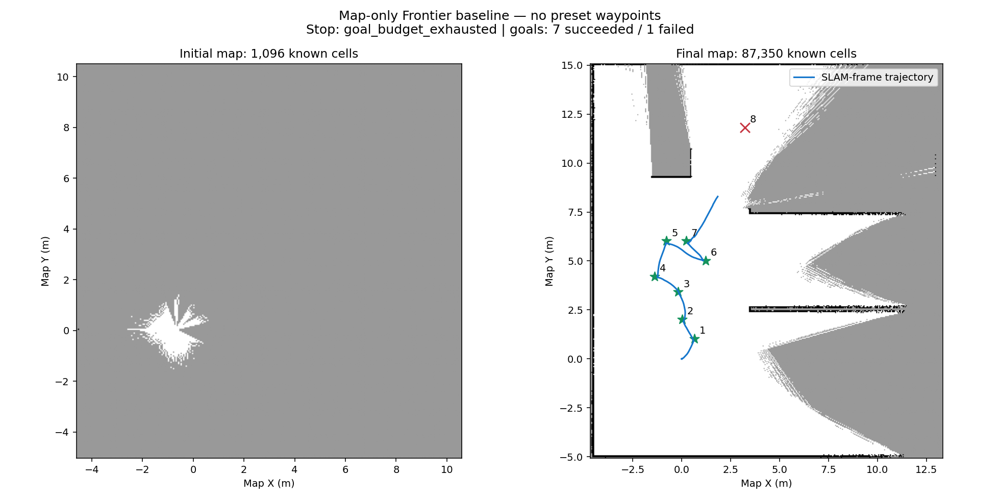

# 保守与激进 Frontier 策略对照

激进策略已实跑，能够向起点北侧推进，信息收益提高；第八段受到独立停车保护约束，被取消。两次运行最终均确认停车，整屋探索仍未完成。

| 指标 | 保守版 | 激进版 |
|---|---:|---:|
| 目标成功 / 尝试 | 4 / 4 | 7 / 8 |
| 墙钟时间 | 516.7 s | 791.8 s |
| 仿真时间 | 154.2 s | 225.4 s |
| 里程计距离 | 6.28 m | 13.18 m |
| 初始已知面积 | 2.74 m² | 2.74 m² |
| 初始旋转后面积 | 131.74 m² | 132.02 m² |
| 最终已知面积 | 143.73 m² | 218.38 m² |
| 导航阶段新增面积 | 11.99 m² | 86.36 m² |
| 导航新增面积 / 行驶距离 | 1.91 m²/m | 6.55 m²/m |
| 共同仿真时长约 154.2 s 的已知面积 | 143.73 m² | 188.58 m² |
| 最小雷达距离 | 2.698 m | 1.881 m |
| 停止原因 | 无符合规则候选 | 达到 8 目标上限 |

共同时间对照使用最后一个不晚于 154.179 秒的样本，激进样本时刻为 154.136 秒；不外推。面积约多 31.2%，单位行程导航新增面积约为 3.43 倍。已知面积不是覆盖率，单次运行也不能证明统计稳定性。

## 策略变化

使用全周射线的可见未知面积代理量，结合实际规划长度与起始转向成本选点。距未知的全方向圆形限制改成较小中心间距加原始地图上的朝向车体轮廓检查。允许满足地图增长和冷却条件的有限重访。已知障碍间距、Nav2、SLAM 与独立停车保护保持不变。

8 项纯地图/评分测试通过，包括朝向轮廓不能进入未知区域、已知墙体遮挡信息估计和距离/转向评分。SLAM 最终检查通过。这次同时改变三类决策规则，无法把收益单独归因于评分或包络检查；下一步需要消融对照。

## 第八段为什么失败

第八个目标初始规划长 6.83 m，路径执行至约 `(1.84, 8.29)` 时最近雷达距离降到 1.881 m，独立 guard 停车。位置持续无进展后，探索器取消 action，Nav2 返回 CANCELED（5），记录 `no_motion_progress` 并确认速度为零。随后达到 8 次目标上限而结束。

目标姿态检查未约束整条路径的雷达停车圈，Nav2 允许通过的间距与 guard 的要求存在差异。这是下一步应统一的规划/保护约束，不能靠关掉保护解决。没有碰撞接触传感器计数，本报告不声称碰撞次数为零。

## 到点是否应该再次四周扫描

当前雷达配置是 360°、360 条水平采样、12 m 量程，行进时持续扫描四周，并非只有前向视场。现策略到点后只等候地图更新，没有显式选择主动观察动作。SLAM 以 0.2 m / 0.2 rad 运动阈值接收新扫描，所以静止等待不等于不断积累新关键帧。

后续应在同一个信息收益决策中比较：继续移动、换到遮挡另一侧、短角度旋转、在有足够转动间距时完整扫描。旋转可能补充采样、产生关键帧，并因雷达相对转轴偏置改变观测位置，但不能穿透墙体。应依据实际地图增量停止无收益扫描，而不是每到一点都固定转一圈。

当前地图仍是判断可达性和遮挡的依据；选点目标应是预计获得的新观测，而非单纯最近距离。主动观察动作未混入本次运行，保留此结果作为后续对照。

## 文件与复现

两次原始报告、事件、轨迹、地图快照、PGM/YAML、质量评价与图像同目录。实现说明见 `docs/frontier-exploration.md`。从全新仿真及全新地图分别用 `--policy conservative` 和 `--policy aggressive` 启动，两次均为 `--initial-scan --max-goals 8 --wall-budget 1200 --goal-timeout 300`。历史保守版报告保留原来的 policy 名称。

程序、镜像和原始实验数据均在额外数据盘；没有安装宿主机系统包。`manifest.json` 记录激进运行实现与共享配置哈希。

激进地图离线配准后已观察表面误差中位 2.80 cm、P95 6.17 cm；此项不验证完整覆盖与 free-space 正确性，真值未用于决策。
