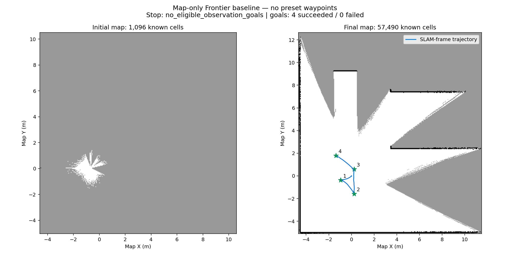
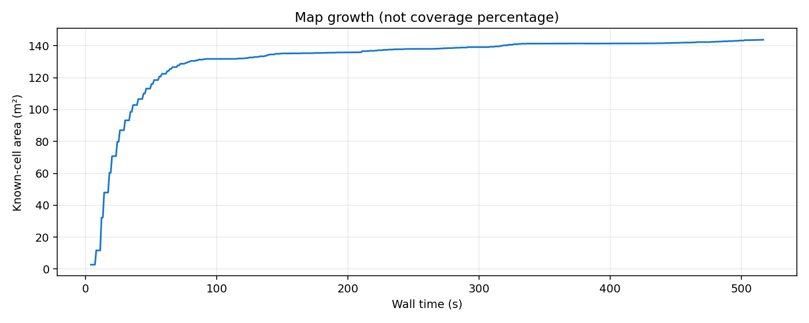

# Frontier 首轮实测：流程通过，整屋探索未完成

运行：`frontier-baseline-v3-20261003`。从新地图开始，无预设航点，不读取场景真值选目标。实现与运行数据均保存在额外数据盘；未安装宿主机系统包。

| 指标 | 结果 |
|---|---:|
| 自主目标 | 4 个，全部 Nav2 SUCCEEDED |
| 墙钟耗时 | 516.7 s（8.6 分钟，含启动检查） |
| 初始到最终仿真时间差 | 154.2 s |
| 里程计累计距离 | 6.282 m |
| 已知栅格 | 1,096 → 57,490 |
| 已知面积 | 2.740 → 143.725 m² |
| 初始旋转后已知面积 | 131.735 m² |
| 四段导航阶段新增面积 | 11.990 m² |
| 全程采样最近雷达距离 | 2.698 m |
| 最终速度 | 线速度 0，角速度 0 |
| 停止原因 | `no_eligible_observation_goals` |

## 能证明什么

地图 → frontier → 安全观察点 → Nav2 规划 → 执行 → 更新地图 → 重新选择目标的循环已经运行。五项纯地图测试通过；独立 15 秒预算取消试验中，Spin 被取消（状态 5）并确认停车。正式运行四次导航均成功，最终自动停车。

不能据此声称整屋探索完成、覆盖率达到 95%、碰撞次数为零或动态避障/卡住恢复已验收。没有定义可探索区域分母，`coverage` 保持 null；最近雷达距离不是机器人外壳间距，也不是碰撞传感器记录。

## 为什么停在起点附近

最终仍有 4 个 frontier 簇、214 个符合保守包络的粗栅格。去掉已访问位置排除时有 6 个候选，保留本轮排除时为 0。说明安全候选区域与已访问位置排除共同限制了继续探索，不能解释成未知区域已经探索完毕。

初始旋转贡献了大部分已知面积增长。短步导航频繁调整朝向，新增信息偏少。下一版应优先改进观察点生成与重复访问策略：允许地图明显变化后有限重访、结合预计可见未知面积和转向成本选点，并单独验证通过狭窄区时的车体朝向约束。不要简单降低独立停车保护。

## 建图质量与故障记录

离线使用 Gazebo 几何作一次刚体配准，已观察 occupied 表面误差中位 2.67 cm，P95 6.35 cm，15 cm 内比例 100%；名义变换下 P95 为 6.80 cm。这仅衡量已观察表面，不衡量完整覆盖或 free-space 正确性。几何文件没有进入探索策略。

首轮 `frontier-baseline-20261003` 旋转后地图不增长，已定位并修复 SLAM Toolbox 纯旋转扫描被距离门限丢弃的问题。第二次启动 action 在节点激活前被拒绝；现显式等待 Nav2 生命周期 active。两次诊断报告保留，不计入正式运行成功次数。第三次运行的初始快照仍为同样的 1,096 栅格，之前被拒绝的动作没有移动车辆。

完整 JSON、事件流、轨迹、地图快照、PGM/YAML 和质量图与本记录同目录；`manifest.json` 保存实现及配置哈希。原始运行日志位于数据盘 `logs/frontier-*.log`。
