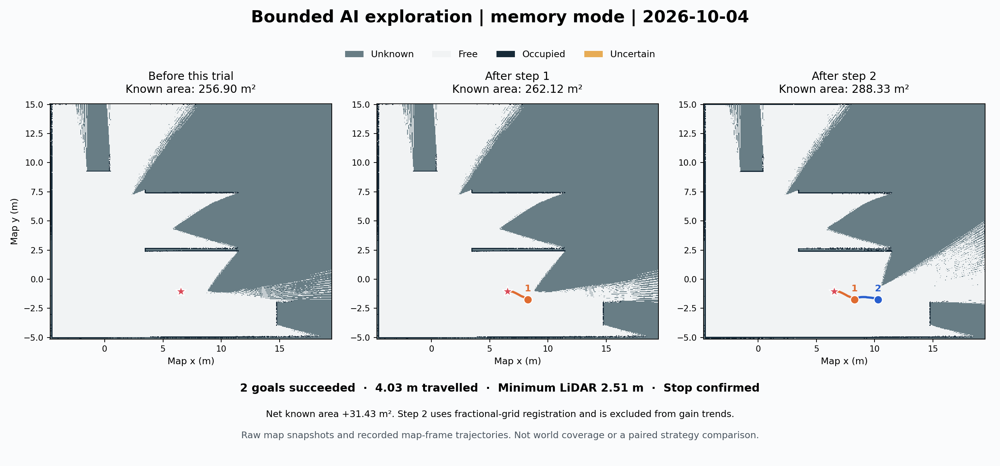
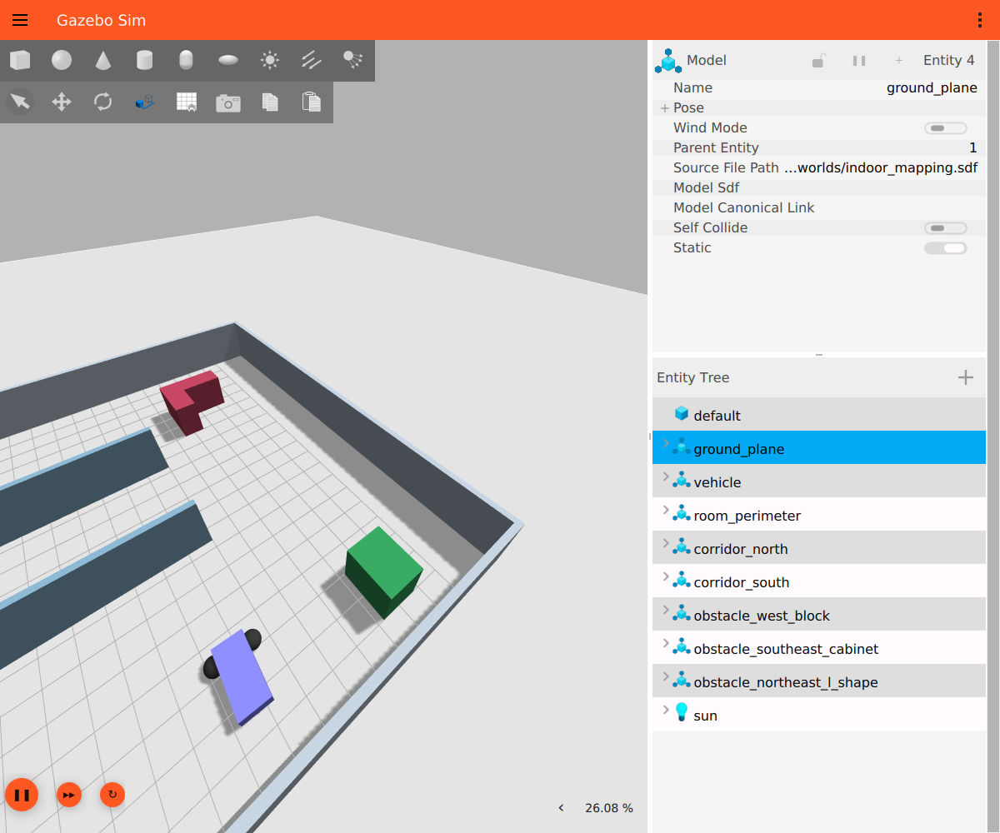

# 2026-10-04：从安全选点到有界 AI 探索

今天完成了路径与停车保护的一致性修复、OpenAI → MCP → Robot Skills 的受限闭环、有界 Frontier/观察决策，以及可选的探索记忆模式。最新实跑中，小车连续换到两个观察位置，地图已知面积增加；下一阶段要让它更有目的地揭示尚未了解的区域。

**已验证的是受约束的闭环与本轮向外推进，尚未验证整屋覆盖、模型优于经典策略或长期防循环效果。** 所有结果来自同一静态仿真环境的连续开发，初始地图与位置不同，不能把今天各轮相加当成公平性能对照。

## 最新实跑与结论图片

实际 RViz 截图：机器人已移向地图右侧，新视角改变了未知边界。深色区域仍有大量 unknown；图形形状本身不能判定未知成因、可达性或覆盖率。此图替换仓库首页旧对照图，旧实验仍保留在 [10 月 3 日记录](../2026-10-03/frontier-comparison/README.md)。

上图由保存的原始 OccupancyGrid 和地图坐标轨迹重绘，三个面板使用相同世界坐标范围；不是三个同时存在的在线窗口，也没有把未知填成自由空间。第二步地图原点发生非整数格偏移，因此不能逐像素硬相减。重绘脚本见 [render_figures.py](render_figures.py)，输入快照与轨迹在 [memory-maps](memory-maps/)。

Gazebo 图只作环境展示；场景真值没有传入模型决策或候选收益计算。截图为未合成的窗口采集，调整的只是观察相机。

### 两步结果

运行模式为 `memory --expansion`，上限 3 次 Frontier 提交、12 m、180 s 仿真时间、900 s 墙钟，失败上限 2。会话 `ce973082-963d-4834-ae7c-934453a3e430`。

| 步骤 | 本地决策类别 | 规划路径 / 实际里程 | 新增 / 丢失 / 净已知面积 | 最近雷达 | 结果 |
|---|---|---|---|---|---|
| 1 | EXPAND_REGION，进入 R_2_-1 | 2.067 / 1.937 m | +5.213 / −0 / +5.213 m² | 2.779 m | succeeded，stopped=true |
| 2 | LOCAL_EXPLORE，继续向该分区外侧边界移动 | 2.239 / 2.090 m | +27.987 / −1.772 / +26.215 m² | 2.515 m | succeeded，stopped=true |

合计行驶 **4.026 m**，全程最近雷达 **2.515 m**，已知面积 **256.903 → 288.330 m²**，净增加 **31.428 m²**。第一步地图整数格对齐，可用于地图窗口趋势；第二步为非整数原点的面积交叠配准，`usable_for_trend=false`，探索记忆的收益为 null。两步均不声称严格的动作因果收益。

最后仍有 **6 个安全候选**，剩余约 **40.0 s 仿真时间**，最短动作估计 **53.4 s**，故以 `no_action_fits_remaining_budget` 结束。不是 guard 触发、不是走满 12 m，也不是全图探索完成。Nav2 取消/暂停与新鲜零速里程计验证通过；停车锁有效，无活动会话。原 1.9 m guard 与 2.15 m 路径要求未放宽。

两次结果各写一个权威探索事件。实际没有低收益观察，所以本轮没有触发低收益/ABAB 过滤，不能把“没有往返”归功于该过滤已被在线验证。

证据：[简明汇总](evidence/memory-trial-summary.json) · [完整模型上下文、候选与本地结果](evidence/memory-trial-live.json) · [运行前状态](evidence/memory-trial-before.json) · [停车后状态](evidence/memory-trial-after.json)。

## 今天的进展与问题

| 阶段 | 实际进展 | 暴露的问题及处理状态 | 证据 |
|---|---|---|---|
| 路径/guard 一致性 | 加入雷达 TF 偏置、沿途朝向和地图/路径更新复核；归档危险路线被拒；最终两轮 5/5 目标成功 | 原第八段终点可行、途中雷达 1.881 m；回放使用最终地图且旧路径无 yaw，不能宣称在线完整复现 | [实现与验收边界](../../guard-path-clearance.md)、[验证数据](guard-clearance-validation.json) |
| API → 只读状态 → 固定前进 | MCP 只读状态、固定 0.4 m 请求、幂等重放、取消及停车确认跑通；模型实走约 0.256 m | 固定请求距离不等于实际里程；还不是任意目标或长期自主控制 | [固定运动说明](../../model-motion-trial.md)、[验证](evidence/motion-trial-validation.json) |
| 六工具 Frontier | 模型只选安全候选 ID，本地账本、仲裁、执行前复核和 supervisor 决定结果 | 曾出现 worker/导航故障，保留 indeterminate 与恢复证据，没有删除记录或把 accepted 写成成功 | [接口](../../robot-skills-mcp.md)、[验证](evidence/robot-skills-validation.json)、[故障恢复](evidence/skills-failure-recovery.json) |
| 连续 Frontier / 可选 observe | 有界循环、预算过滤、模型 STOP、固定观察选项及参数拒绝 | 曾遇候选临期、TF 回调积压与停车原因竞态，已修复；一次旋转因地图变化导致车体扫掠非自由而取消，不能计作成功观察 | [循环说明](../../bounded-exploration-agent.md)、[观察中止](evidence/model-observation-execution.json)、[回放与参数拒绝](evidence/observation-replay-validation.json) |
| 区域探索 | 分区候选配额、低即时收益通行段、转移意图和逐步地图变化账本；早期三次成功动作共约 4.200 m | API 连接错误结束一轮；续跑客户端 SIGTERM 后由 watchdog 停车，后补信号收尾，原记录与重建记录都保留 | [初轮](evidence/regional-model-validation.json)、[原中断记录](evidence/regional-model-continuation.json)、[账本重建](evidence/regional-model-continuation-reconciled.json) |
| 扩大探索额度 | 经用户要求扩大至 20 次/80 m/900 s 仿真/3600 s 墙钟；两会话共 6 次成功、1 次超时、1 次用户取消 | 第一会话两步后空候选；后续有重复通道/区域访问、长目标超时与较低收益。不能把通行回程一概叫振荡，也不能把超时当墙 | [扩大额度](evidence/expansion-budget-extension.json)、[初轮](evidence/expansion-aggressive-20261004.json)、[续跑](evidence/expansion-continuation-20261004.json) |
| 未知语义与 memory 模式 | 区分 unknown/uncertain/occupied；增加第一未知边界代理、持久化终态记忆、失败作用范围和候选执行前策略重查 | 历史笼统位置排除会减少候选；最新离线 baseline/shadow 各 2 个姿态候选、memory 9 个，但当时未做 Nav2 检查。随后本页实跑完成两步 | [模式说明](../../regional-exploration.md)、[离线回放](evidence/exploration-upgrade-replay.json)、[验证](evidence/exploration-upgrade-validation.json) |

已完成相关回归 **166 项**，独立上传包测试 **65 项**，两组分开统计；此前文档中 30/57/93/119/141 等数字是不同开发阶段的历史测试规模，不能相加。此次发布核对实现源码哈希与最后验证记录一致。测试不代表动态障碍、任意进程故障或真实硬件验收已完成。

## 对截图反馈的采纳与校正

采纳核心结论：**安全换观察位置已经带来新的地图信息，下一步应增强“选择能揭示哪块未知区域”的目的性，而不是仅增加运行额度或调整提示词。** 以下区分记录已支持的事实与仍需实验检验的判断。

1. **已有 Frontier 距离字段。** 本轮两步 `frontier_distance_m` 分别为 **0.566 m、0.600 m**，所以不能根据截图认定“距离 Frontier 太远”。建议的 0.8–2.5 m 只是待标定偏好范围，不能直接替代 footprint 或 guard 安全检查；硬套下限反而会删掉本轮两个有效候选。
2. **已有增量可见性。** 旧的沿途未知新颖性代理与新的第一未知边界差集并存，不是只数附近 unknown。第一未知边界的候选总量/增量分别为 **0.0625/0.0575 m²** 与 **0.1500/0.1200 m²**；离线相除得到新颖比例 **0.92、0.80**。它只比较稀疏采样到的未知边界集合，不表示整幅视野的重叠率，更不是未来可揭示的实际面积。因此截图不能证明本轮“视线重叠太大”。这些比例尚未加入在线评分。
3. **已有区域记忆，缺少稳定的跨轮 Frontier 簇关联。** 当前 `R_ix_iy` 是 4×4 m 地图分区，不是房间或 Frontier 簇。需要处理簇移动、分裂、合并和地图修正，才能把多视角观察同一边界与合法绕行区分开。
4. **楔形 unknown 不证明决策无目的。** 遮挡、量程、稀疏观测与 SLAM 处理都可能形成这种形状；原始占据图无法单独反推历史原因。应比较实际候选、TF、扫描和地图变化。
5. **地图外框不增长不等于没有探索。** 本轮栅格从 483×403 到 483×404，外框基本没变，但已知面积增加约 31.43 m²。候选本来就必须落在已知自由区。是否存在范围限制，需要记录 known/frontier 的世界坐标包围盒、边缘射线、截断和搜索失败原因，不能把扩大数组面积当收益。

## 下一阶段优先级

1. **标定动作时间及预算开销。** 本轮两步预计 54.91/67.23 s，实测任务窗口为 26.72/32.73 s；两个样例不足以整体减半预算系数，但差异值得定位。区分纯导航、转向、反馈等待、规划和模型耗时；保留原预算机制，不为跑满三步绕过剩余额度检查。
2. **把新颖比例和收益误差纳入可检查的诊断。** 输出原代理、第一边界总量/差集、比例、相邻候选重复度、实测地图变化及有效性。零分母用 null，缺失收益不能写 0；先 shadow 对照，再决定是否改权重。避免把同一增量收益重复乘权，或让狭窄可见扇区因比例高而被过度奖励。
3. **建立稳定 Frontier 簇历史。** 基于地图 epoch 和空间边界匹配，跟踪分裂/合并、有效低收益及失败入口；将簇的观察优先级与通行资格分开。已有 region 记忆继续保留，路径失败不扩散为永久区域禁区。
4. **有针对性的对照验收。** 固定初始地图、起点、扫描和预算，分别比较 baseline、几何/记忆策略、相同候选上的模型策略。单独设置低收益重复、另一入口可达、经过旧点去新区域等场景；三任务小试验通过后，再明确配置更长观察窗口。当前新模式三任务上限不自动扩大为 5–10 步。

建议每步统一保存八类信息：前后位姿、稳定 Frontier 簇关联及置信度、路径长度、增量收益代理、实际新增/丢失/净面积和有效性、Frontier 距离、新颖比例、区域/失败历史及选择理由。现有字段优先复用，新增字段先记录，再通过对照证明其价值。

## 复现与证据索引

- 代码入口与运行说明：[区域探索](../../regional-exploration.md)、[MCP](../../robot-skills-mcp.md)、[API 环境](../../openai-environment.md)。本页命令和图片不授权自动恢复小车。
- 数据目录：[evidence](evidence/)、[memory-maps](memory-maps/)；哈希：[artifact-sha256.json](artifact-sha256.json)。JSON 保留历史运行路径及任务 ID，但不包含 API 密钥、认证文件或活动任务数据库。
- 独立探索包及来源哈希：[experimental/exploration_upgrade](../../../experimental/exploration_upgrade/)。它的离线测试不等于原项目或在线验收。
- 重绘：在仓库根目录执行 `python3 docs/experiments/2026-10-04/render_figures.py`，需要 NumPy 与 Matplotlib，仅读取归档数据，不连接 ROS 或调用模型。

本日结采用用户提供的截图反馈作为后续研究建议，并以本地原始运行数据校正事实判断。没有把截图推测写成已确诊问题，也没有宣称解决了整屋自主探索。
