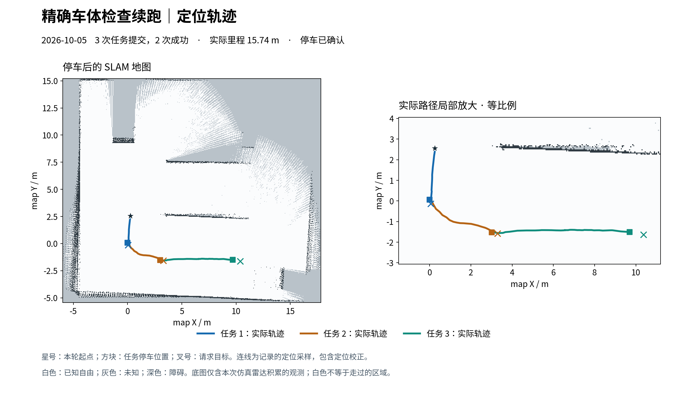
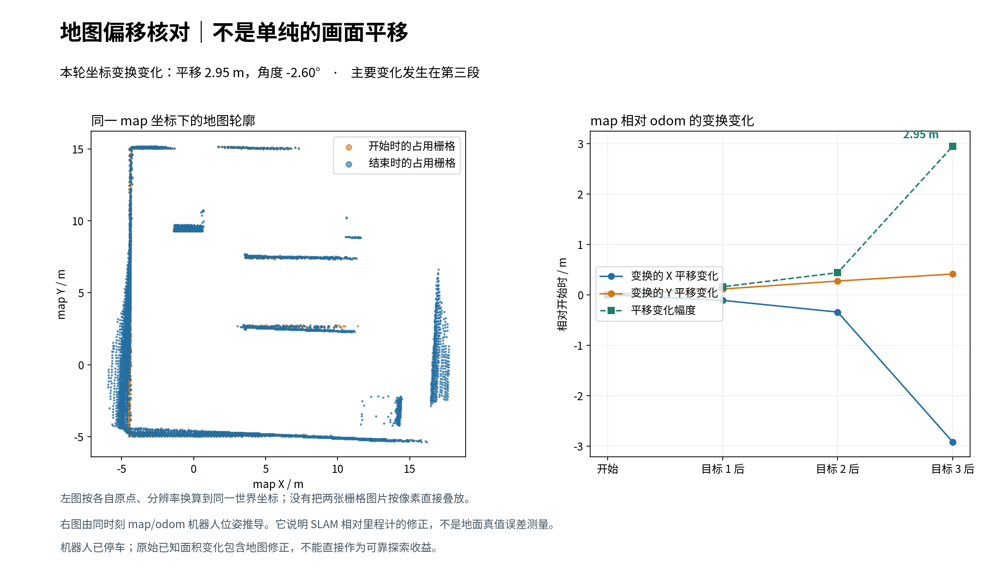

# 精确车体检查与有界续跑（2026-10-05）

已修复两处妨碍连续探索的设计：车体检查多余的整格对角线膨胀，以及 hour 模式首个几何失效任务结束整场实验的门槛。在线续跑已结束；结果及地图偏移诊断见下文。

## 在线结果：12 分钟后安全停止

本轮于 11:10:20 BST 开始，约 722.86 秒后结束，未运行满剩余 57 分钟。共提交 3 个目标，2 个成功、1 个因路径净空检查中止，累计里程 15.7380 m。已确认停车，停车锁有效；无活动 mission，新鲜里程计和 guard 输出速度均为零。客户端正常收尾，systemd 退出码 0，临时防休眠已释放，定期监测已暂停；未重置额度或自动续跑。

| 次序 | 终态 / 原因 | 里程 m | 最小雷达 m | 原始地图净变化 m² | 可比较收益 m² |
|---|---|---:|---:|---:|---|
| 1 | succeeded / goal_reached | 2.6101 | 3.185 | +33.7275 | null |
| 2 | succeeded / goal_reached | 3.8613 | 3.411 | +27.1850 | null |
| 3 | aborted / path_guard_clearance | 9.2666 | 2.792 | +54.6975 | null |

地图原始已知面积 230.8675 → 346.4775 m²（+115.6100 m²）。三步均存在非整数栅格原点变化，反馈不足，可比较收益保留 null。这不是可靠因果收益、整屋覆盖率或公平策略对照结果。

第三个目标中止原因为 `path_guard_clearance`：预测净空 2.072718 m，小于既定 2.15 m；实际最小雷达距离 2.792371 m。这次没有发生车体扫掠中止。使用精确触发地图和剩余路径离线重算，净空与在线值差为 0.0 m，见 [精确回放](invalidation-replay.json)。

中止后循环继续搜索两批共 6 个当前采样候选，全部路径净空检查不通过，因此以 `candidate_generation_unavailable` 结束；最后目录标记 candidate_search_incomplete，但 more_candidates=false。不是预算耗尽，也不能推断整屋没有其他路径。新增“首步车体失效后另选”分支有测试，但本轮首步成功，所以不能声称本轮触发了该首步分支。

## 用户观察到的地图偏移

确有较大的 SLAM 坐标修正。将同一时间戳的机器人 map/odom 位姿组成 SE(2) 变换：初始平移 (-0.11794, 0.13814) m、偏航 -0.79985°；结束平移 (-3.03712, 0.55039) m、偏航 -3.39936°。相对初始的平移变换变化幅度 2.94815 m，偏航变化 -2.59951°；主要平移变化发生于第三段。这不是直接测得的地面真值误差，也不表示整张地图刚性平移了同样距离。

叠图按每张地图的原点/分辨率转换到同一 map 坐标：旧墙体大体对齐，但新增观测的部分墙线出现加厚和偏斜。栅格原点从 (-4.64842,-5.03706) 到 (-5.97652,-5.44339) m，画布由 321×405 扩为 476×413，属于另一项变化，不能把这个原点变化直接解释成定位误差。

第三段里程计行驶 9.2666 m，而 map 端点位移约 6.69 m，期间 map/odom 平移变换变化约 2.58 m，地图轨迹不能单独代表真实行驶里程。SLAM 日志也存在 Message Filter queue full 的扫描丢弃记录，但这些记录不足以确诊根因。后续应核对扫描匹配质量、TF 时序、负载及地图修正过程，再决定如何恢复长运行；本轮不改动 SLAM 或安全阈值。

[配对位姿与变换计算](map-odom-shift.json) · [最终只读停车状态](final-live-state.json) · [停车任务](stop-task.json) · [完整在线报告](trial.json) · [当前 RViz 界面](live-rviz-final.png)

原始最终位姿图已保存为仓库 workspace/maps/body-precision-final-20261005，序列化返回成功；未替换当前地图。以下保留修复设计与验证记录。

## 几何判定

旧算法把车体多边形的每条边向外扩张 `padding + resolution × sqrt(2) + sample_step / 2`，再测试格心；5 cm 栅格下该值约 14.57 cm。这会把与车体保持实际间距的栅格也纳入，并在凸角产生额外扩张。

新算法用分离轴判断凸车体多边形与完整栅格方块是否相交；若分离，则计算顶点—边最小欧氏距离。保留配置车体外形、5 cm padding、2.5 cm 连续运动采样余量，但不再额外加一整格对角线。未知、占用和不确定格只要真正侵入这个包络仍被拦截，越出地图也拒绝。雷达 guard 1.9 m、路径净空 2.15 m、路径姿态及转弯预测保持不变。候选姿态与完整路径共用同一检查，消除两处重复几何逻辑。

在上一小时试验停车地图上，3444 个姿态的离线对照：旧算法通过 2495 个，新算法通过 2526 个，新增放行 31 个，无反向变化。这只证明车体姿态筛选少了额外保守性，不等于 31 条可执行路径，更不等于实测新增地图。

## 精确证据与继续条件

上一小时失败见证位姿在归档的 before/stopped/settled 三份地图上均通过旧检查；触发瞬间的地图版本与这些快照不同。因此不能宣称原中止已被复现或被证明是误报。

现在失效时先在内存冻结实际触发地图、剩余路径、当前姿态、候选、阻塞格及地图版本，取消导航并确认停车之后再写 `.detail.invalidated.npz` 与 `.detail.invalidated.json`。日志写入失败不会延迟取消，也不会替代停车结果。阻塞格可区分 unknown / occupied / uncertain，并记录到车体的距离。

hour 模式首个任务因 `body_sweep_nonfree` 中止、且 stopped=true 时，不再仅因该门槛结束整场试验。保护锁优先、未确认停车仍终止，正常预算检查仍生效；原模型循环重新读取地图、生成候选并另选目标，不重发旧任务，不清除任何锁。trial/extended 的小试验首步门槛保持不变。

## 续跑

用户要求改进检查并继续探索后，从当前地图约 230.8675 m² 及停车位置继续，不加载旧完整地图。扣除上一小时实验消耗，剩余 3451 墙钟秒、3532 仿真秒、59 任务、239.6797 m、2 次失败，诊断间隔单列。通过 systemd 用户服务 robot-body-precision-20261005.service 托管，临时防休眠和定期结果监测在运行时启用，现已释放/暂停；不自动重启新试验。

## 验证

- 新增 4 个几何测试覆盖精确边/角距离、旋转、未知格误拦恢复及真实侵入、地图边缘和坐标系旋转。
- 已有转向扫掠、路径净空和车体中途侵入测试保留。
- 导航测试首次运行 101 项，其中 100 项通过，1 项因容器缺少历史回放文件报错；补齐归档夹具后对应 12 项路径测试全部通过。新增精确触发快照测试在 11 项执行器安全测试中通过。
- Agent 48 项全部通过，包括几何中止后的新候选重选、保护锁阻止继续、未确认停车和其他停止原因不得走此恢复分支。新增测试早期夹具缺少目录模式字段导致失败，修正后通过，未降低生产检查。
- git diff --check 通过。该阶段结束时尚未提交；本次统一归档发布。原有 RViz 修改和 papers 保留。

[几何对照](geometry-comparison.json) · [原失败见证回放](witness-cells.json) · [扣除后的预算](continuation-budget.json)

输出 evidence 为归档快照，实时原始日志位于仓库 docs/experiments/2026-10-05/body-check-audit/trial.json。在线收益配准无效时仍保留 null；实际路径及终态现已归档。
