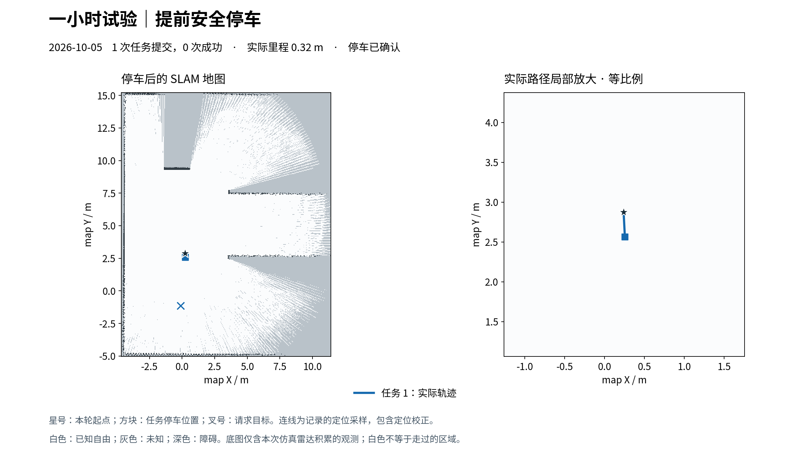

# 一小时有限视野试验：提前停车

**未完成一小时探索。** 10:34:28 BST 启动，约 148.7 秒后结束（约 2 分 29 秒，包含选点、模型等待、执行及停车）。首个目标只行驶 0.3203 m，更新地图上的剩余路径车体扫掠检查不通过，任务中止并确认停车。客户端正常收尾，systemd 主进程退出码 0；本次没有重现心跳丢失，但这段短运行不足以证明一小时稳定性。

## 实测结果

| 指标 | 结果 |
|---|---:|
| 运动任务提交 / 成功 / 中止 | 1 / 0 / 1 |
| 实际里程 | 0.320321 m |
| 最小实时雷达距离 | 3.277287 m |
| 初始已知地图 | 224.075007 m² |
| 停车后已知地图 | 230.867507 m² |
| 原始已知面积净变化 | +6.792500 m² |
| 可比较收益 / 严格因果收益 | null / 未证实 |
| 停车 | 已确认，停车锁有效 |

从此前当次雷达积累的局部地图继续，没有重置地图或加载旧完整地图。面积比较采用 fractional_cell_area_overlap，地图原点移动约 -0.7855 个栅格，accepted scan 证据不可用；原始变化不能作为可靠动作收益或整屋覆盖率。没有成功目标，也没有在线防循环触发证据。

## 为何提前结束

当前地图送检后有 6 个可执行候选。模型选择尚无成功访问的 R_-1_-1，目标约 (-0.1091, -1.1371)，规划长度 4.0550 m，预算估计 63.97 仿真秒；派发时仍余约 3560.40 仿真秒，因此不是时间预算不足。

执行前完整车体扫掠通过（897 个采样），路径预测最小雷达净空约 2.5845 m。运动后地图更新，剩余路径复核得到 `body_sweep_nonfree`，见证位姿约 (-0.1091, -0.8621, -1.5708 rad)，位于前方靠近目标的路径段；同次预测雷达净空仍约 2.7101 m。机器人在约 (0.2549, 2.5609, -1.5616 rad) 停车，未到达见证位置。日志没有碰撞证据，也不能仅凭此码断言是新增障碍或安全检查误报。

wide 模式保留“首个直接目标必须成功并确认停车”的试验门槛，因此一次中止就结束本次会话，虽然总失败预算为 3。会话原因 `first_action_not_successfully_stopped` 指首步未成功，**不是停车未确认**。运动终态是 aborted/body_sweep_nonfree/stopped=true；独立停车任务 `46790211-db97-42cc-8524-c76bee6aacd5` 为 succeeded/stop_confirmed_and_latched。

## 运行与后续状态

用户授权预算为最多 3600 墙钟秒、3600 仿真秒、60 任务、240 m、3 次失败；1.9 m guard、2.15 m 路径条件和完整车体检查保持不变。systemd 只负责托管，Restart=no，既有 watchdog 保持启用。

运行已结束，最新现场只读状态确认：无活动 mission、停车锁有效、新鲜里程计及 guard 输出线速度/角速度均为零。临时防休眠服务已停止并释放锁，定期监测已暂停。没有自动续跑、重置额度或修改保护条件。

下一步应回放触发见证附近的前后栅格和车体包络，区分地图更新带来的真实路径失效与检查保守性，再评估首步失败后是否有其他安全入口。现有证据不足以直接放宽扫掠或宣称整屋探索可持续。

## 证据

- [完整在线报告](trial.json)
- [任务与指标摘要](summary.json)
- [最新只读停车状态](final-live-state.json)
- [停车任务终态](stop-task.json)
- [系统服务终态](service-final-state.txt)

导航任务 `992f54d2-0cc7-4724-95ac-1875b805e07a` 的前后原始栅格、定位轨迹、事件记录与选点目录已归档在 evidence。报告由原客户端完整写出，没有从账本拼接恢复。source-snapshot 保留启动时的代码；技能测试 58 项、Agent 测试 47 项通过，git diff --check 通过。这些不替代未完成的一小时实跑。
