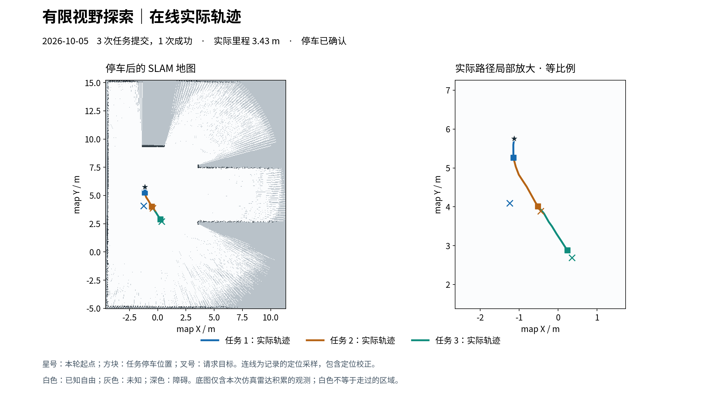

# 有限视野探索：在线续跑记录（2026-10-05）

**结论：从本次传感器观测积累的局部地图出发，能够继续移动并扩大已知地图；持续长时间自主探索尚未通过验证。** 续跑 2 次提交，1 次成功，行驶 2.9031 m；第二次因客户端进程退出、心跳丢失而取消。续跑地图已知面积从 169.4725 增至 224.0750 m²（原始净变化 +54.6025 m²）。配准/反馈条件不足，三个导航任务的可比较收益均为 null，不能把面积变化直接当作严格因果收益。

目前停车锁有效，里程计和 guard 输出线速度/角速度均为零。最终停车任务 `21a1b314-6a5a-4226-a93b-922763826bda` succeeded/stopped=true。Gazebo 后端、SLAM 和 RViz 保留运行，机器人不再移动。Gazebo 三维 GUI 启动失败，展示的是实际 RViz 界面。

## 范围和隔离

- HEAD 为 `ab046c31c4e8ebb33f19c322b290aa8ceeb920c3`。该阶段结束时代码/文档尚未提交；本次统一归档发布。原有三份 RViz 配置修改及 papers 保留。
- 按用户“不提供全部视野”的要求，先备份旧地图，然后重置 SLAM，只用本次雷达扫描建图；未把 Gazebo 世界真值或旧约 415 m² 地图提供给模型。重启 SLAM 时加载的是本次传感器新建的位姿图及实际停车位姿。
- 原始 guard 1.9 m、路径要求 2.15 m、完整车体扫掠及实时障碍层保持不变。4.5 m 是观察点距 Frontier 的搜索范围，不是降低障碍净空。
- 默认 trial 新模式仍最多 3 次任务；用户明确要求长试验后使用显式 extended，初始上限 20 任务 / 80 m / 900 仿真秒 / 3600 墙钟秒 / 2 次失败。续跑扣除前次消耗，限 19 任务 / 79.4738 m / 851 仿真秒 / 3486 墙钟秒 / 1 次失败。人工诊断间隔另记，不计作活动会话时间。

## 初始化与导航分开记录

空地图默认初始化仅约 2.84 m²；允许静止扫描进入 SLAM 后约 59.15 m²。检查发现正无穷无回波束被原 Karto 输入忽略，局部车体周围仍有未知楔形空隙。可选 Gazebo 专用适配器仅向 SLAM 提供规范化无回波，搭配 11.9 m 建图截断，初始化地图约 99.43 m²。以上变化均非导航收益。

传感器契约由实际仿真配置及 [Gazebo GpuLidarSensor 源码](https://raw.githubusercontent.com/gazebosim/gz-sensors/gz-sensors10/src/GpuLidarSensor.cc) 核对；[Karto AddScan](https://raw.githubusercontent.com/SteveMacenski/slam_toolbox/ros2/lib/karto_sdk/include/karto_sdk/Karto.h) 语义另通过安装版 C++ 集成测试验证：无回波射线清空到 11.9 m、不形成虚假障碍端点。有限命中、NaN、负无穷保持不变；Nav2/guard 仍使用原始 /scan。

在纯导航尚无完整安全路径时，本地操作者选择已有受保护观察技能，原地实际转动约 36.9°，几乎无平移，最小雷达距离 2.805 m。该操作不是模型导航。任务窗口从 99.43 增至 114.83 m²，后续静止积累到 142.73 m²；这也不混入模型导航收益。首轮曾启用 0.4 m 最小目标距离的 short-start，所有路径检查照常执行；本次续跑已恢复 1.2 m。

## 三次模型导航（累计）

| 次序 | 终态 / 原因 | 实际里程 m | 最小雷达 m | 任务窗口原始净变化 m² | 可比较收益 m² |
|---|---|---:|---:|---:|---|
| 1 | `aborted` / `body_sweep_nonfree` | 0.5262 | 2.818 | +16.1050 | null |
| 2 | `succeeded` / `goal_reached` | 1.4761 | 3.092 | +30.7825 | null |
| 3 | `aborted` / `client_heartbeat_lost` | 1.4270 | 3.468 | +23.8200 | null |

累计导航里程 **3.4293 m**，1 次成功、2 次中止，全部确认停车。第一次中止原因是行驶中更新后的地图使剩余路径车体扫掠不通过；没有碰撞证据。该任务窗口 142.7275 → 158.8325 m²，静止后进一步到 169.4725 m²。

续跑模型收到同一地图 epoch 的前次失败目标概要，选择不同接近路线：先到达 (-0.4452, 3.8877) 附近，再向 (0.3522, 2.6877) 请求导航。第二目标未完成最终姿态，不能按目标成功计数。完整未知边界代理、其他候选拒绝原因和模型选点理由保存在原始报告中。

三个任务地图原点发生非整数栅格位移，accepted scan 证据不可用，因此窗口重叠计算只作诊断；`comparable_gain_m2`、趋势/效率收益仍为 null。累计地图从首次导航前 142.73 到最终 224.08 m² 的 +81.35 m² 还包含任务间静止更新，不能等同于逐任务导航收益之和。真实整屋覆盖率仍未知；本轮未证明在线防循环已触发，也不是公平策略对照。

## 运行中断与日志恢复

续跑客户端命令会话返回退出码 143，其进程和 MCP 子进程消失；外部终止来源尚未确认。独立 watchdog 检测到 `client_heartbeat_lost`，取消导航并确认停车。未禁用心跳保护或自动重置失败额度。此次中断计入剩余失败预算，累计两次失败额度已用完。

原始不完整检查点保存在 `evidence/continuation-interrupted-checkpoint.json`。`continuation-trial.json` 的任务终态、mission 与 final_state 是通过持久化本地账本和现场只读状态补齐，带有 recovery 标记；缺失的完整轮次墙钟时间未伪造。继续长试验前应先核对客户端进程生命周期，外部终止原因目前不能确诊为模型、ROS 或导航故障。

## 验证与证据

技能测试 57 项、Agent 测试 47 项通过；相关执行器 11 项、升级集成 12 项、适配器 2 项和安装版 Karto 无回波集成测试通过。上述是各自测试集结果，不将重复运行累计。`git diff --check` 通过。

- [续跑完整报告](continuation-trial.json)
- [累计摘要与全部任务指标](combined-summary.json)
- [最新只读状态](final-state.json)
- [续跑预算扣除记录](continuation-budget.json)
- [实时 RViz 截图](live-rviz-final.png)

交付目录中的 source-snapshot 保存续跑启动时清单中的 52 份代码/配置，逐份核对 SHA256；适配器及实验 SLAM 配置另外归档并记录 additional-runtime-sha256.json，因为它们尚未包含在原 run_loop 清单中。每个任务的轨迹和前后原始栅格快照也已复制，便于回放。最终新建位姿图保存到 `workspace/maps/limited-view-continuation-final-20261005`，只保存现场，不切换运行地图。
