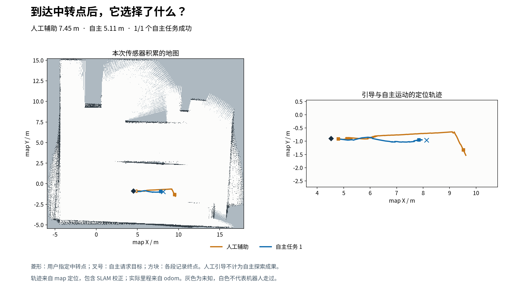

# 中转点辅助引导与自主接管试验

已把机器人引导到用户确认的左侧中转点附近，停车位置距目标 **0.27 m**。交回模型后，它选择向右返回，成功完成一个自主导航目标，随后主动停车。**这次没有继续穿过左侧路口，也没有验证持续扩图。**

## 实际发生了什么

1. 用户确认中转点约 `(4.52, -0.89)`。辅助控制先倒车腾出转向空间，再转向并分段行驶，使用当前传感器地图检查实际运动姿态、完整车体和短距离停止范围，指令经过现有雷达保护。
2. 第一次辅助倒车 0.23 m 后因定位消息超时停车。补上现有执行器使用的 TF 队列处理方式，保持原有效期检查；继续完成余下引导。
3. 第二次辅助在分段次数上限处停车，距中转点 0.273 m。原始运行状态保留为 `aborted / operator_segment_limit`，未伪造精确到点成功；根据用户要求的“中转点附近”接受交接，记录 `handoff_accepted=true`。
4. 自主第一轮有两个本地合格中转候选。模型选择右侧 `(8.13, -0.96)`，打算最终进入 `(12.93, 4.66)` 附近的区域；它引用的远端未知面积代理为 5.40 m²，另一个候选为 2.08 m²。代理不等于实际收益。
5. 自主导航成功并确认停车，实际里程 **5.113 m**，规划长度 3.381 m；SLAM 位置修正影响地图中的移动与实际里程对应，二者不能混用。
6. 第二轮还有一个本地可执行中转候选 `(2.38, -0.75)`，路径 **5.495 m**、预计 **79.42 仿真秒**。模型选择 `STOP`，理由是其远端完整路线 **22.407 m** 超过剩余 **14.887 m** 的距离预算。

## 数值和边界

| 项目 | 结果 |
|---|---|
| 人工辅助累计里程 | 7.446 m，独立记录，不计作自主成果 |
| 人工辅助记录到的最低雷达距离 | 2.287 m |
| 自主导航 | 1 次成功，0 次失败；第二次决策主动停车 |
| 自主累计里程 | 5.113 m |
| 自主记录到的最低雷达距离 | 3.199 m |
| 自主阶段地图已知面积 | 370.505 → 373.950 m²，窗口净变化 +3.445 m² |
| 可比较动作收益 | `null`；小数栅格配准，`usable_for_trend=false`、`causal_action_gain_valid=false` |
| 本轮自主上限 | 最多 3 个运动目标、20 m、600 仿真秒、900 墙钟秒、2 次失败 |
| 路径 / 实时保护阈值 | 1.48 m / 1.9 m |
| 最终状态 | `model_stop`，停车反馈成功，速度零，停止锁已锁定 |

本轮的 **20 m 是实验配置的总里程预算**，不是环境通行上限。最后停车不是因为空候选、实时雷达保护或本地预算拒绝：局部 5.5 m 步骤仍可容纳，模型把远端完整路线能否在本轮完成作为了停止依据。这说明本次条件下它的决策如何受预算影响；不能据此认定它在充足预算下也会停车，也不能判定所有返回旧位置都是无效循环。

本次只使用这场仿真的传感器地图。辅助阶段与自主阶段明确区分；模型接管后未指定坐标、替它选点或强制继续。辅助路段的地图变化不算自主探索收益。

## 实现与验证

增加本地专用 `operator_assist.py` 和实际姿态扫掠检查：倒车保持车体朝向，转向按真实角度检查；Nav2 在辅助期间暂停，独占运动锁，停止命令始终可进入。辅助期间阻止新探索会话和运动任务；离开后将辅助事实加入模型上下文。此能力未暴露为模型/MCP 工具。

针对本次“辅助后继续自主探索”，1.48 m 的本地实验上限扩展为最多 3 个任务，默认路径阈值仍为 2.15 m；更大 1.48 m 会话和预算扩展会被拒绝。实时雷达保护和车体检查保持启用。

验证通过：机器人技能 62 项；模型循环 48 项；辅助几何 4 项；定位队列与超时 3 项；调整三任务上限后任务预算 13 项。`git diff --check` 通过。记录的辅助异常均已停车，没有继续执行未确认停止的任务。

自主会话：`6b753534-a7f6-4232-848e-11f330bdbe75`。成功任务：`b201ba5b-7596-463f-9e1b-391798c23fb0`。所有本轮控制服务和临时防休眠服务均已退出；仿真后端继续运行。

[结构化结果](result-summary.json) · [完整自主日志](trial.json) · [最终候选](final-catalog.json) · [停车证据](stop-task.json) · [辅助证据](../operator-junction-assist/assist-summary.json) · [最终仿真界面](final-rviz.png)
