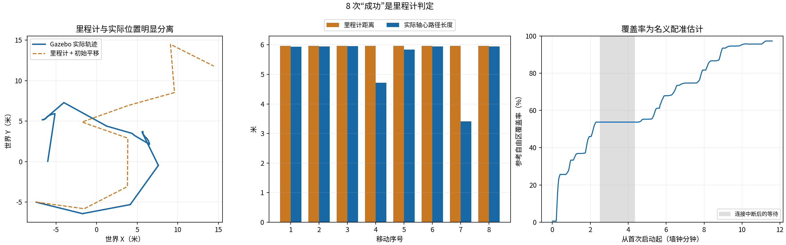

# 2.0 起始实验：选点、轨迹、对比与评价

实验代码：`e3547682246d863cd5c4234b5343976d11406438`。同一场景两段运行，中间模型连接失败后续跑，最后用户停止。整理为 2.0 后没有重跑或改写原始记录。

左侧为 Gazebo 实际轴心世界轨迹；右侧为每次 AI 提交时的 map 坐标目标，叠加停车后的在线地图。两幅坐标系明确分开；地图配准随 SLAM 调整。箭头长度都是 6 米，因为选中激光束均返回最大量程 12 米。第 4、7 步的结束位置不能当成目标到达证明。

## 观测结果

| 指标 | 本次值 |
|---|---:|
| 已完成扫描 / 移动 | 9 / 8 |
| 总经过墙钟时间（含两段间隔） | 696.41 秒 |
| 两段程序实际运行时间合计 | 587.23 秒 |
| Gazebo 实际轴心全程路径（含扫描位移） | 47.55 米 |
| 8 次动作报告里程计距离合计 | 47.69 米 |
| 首圈扫描后覆盖估计 | 25.64% |
| 最终覆盖估计 | 97.25% |
| 覆盖增量 | 71.61 个百分点 |
| 固定参考自由区域 | 465.5 平方米 |
| 8 次成功模型决策合计 / 平均耗时 | 56.17 / 7.02 秒 |

第 4 步实际动作窗口路径约 4.71 米，第 7 步约 3.41 米，均被里程计判定完成约 5.96 米。两次整圈扫描起终点移位约 1.75、1.72 米。原始 odom 初始平移对齐后的最终位置误差约 23.57 米；这不是 SLAM 修正后的 map 定位误差。数据与接触/滑移相符，但无接触传感器证据，不能逐次断言碰撞。

## 与旧系统的总结对比

旧对照采用本地记录的第 6 回合，数据位于上级 `runtime-validation.json`。它不是严格同起点、同速度、同保护设置的控制实验。

| 维度 | 旧两阶段第 6 回合 | 本次 2.0 基线 |
|---|---|---|
| 行动机制 | 传统探索后调查、规划和复核 | 扫描后直接 AI 指定方向并移动 |
| 预算与实际窗口 | 600 秒整场上限 | 两段运行合计 587.23 秒；总经过 696.41 秒 |
| 里程计行驶量 | 约 1.10 米 | 约 47.69 米（8 次移动合计） |
| 覆盖估计 | 27.60% → 27.77% | 首圈后 25.64% → 97.25% |
| 主要现象 | 3 次导航因 body_sweep_nonfree 中止 | 大范围持续行驶，暴露到达与真实位移偏差 |
| 保护条件 | 前期正常、末段用户要求临时绕过 | 全程无碰撞约束 |
| 停止 | 整场预算耗尽 | 第一次 API 连接错误；第二次用户停止 |

**评价：验证成功地获得了过去流程难以取得的连续行动与真实执行数据，足以支持把本次架构作为 2.0 研发主线。** 本次明显扩大了行动范围与观测范围，但无法把差异全归因于模型能力或去除某一条约束；速度、策略、运行条件均不同。没有多回合统计，不能给出稳定性或因果提升百分比。

97.25% 是名义配准下在线自由栅格的覆盖估计，受 SLAM 漂移与分类误差影响；地图仍有灰色遮挡区域，车辆未验证所有通道。8 次动作 succeeded 也不等于 8 次真实目标到达。后续应沿本次连续架构发展，单独检验到达判定、扫描位移与断线续接，不用旧审批链取代连续操作。

## 数据保全与复核

- `run-1.json.gz`、`run-2.json.gz`：原始汇总报告，含 AI 理由、工具调用与源码哈希。
- `raw-actions.tar.gz`：两个运行目录的完整请求、结果、逐步轨迹、地图 PNG/NPZ、配置和日志；包含原始 `STOP` 标记。
- `raw-manifest.json`：归档内每个原始文件的 SHA-256。
- `executed-source.tar.gz`：当时实际执行版本的 workspace、scripts、docker 源码快照。
- `truth.jsonl.gz`、`coverage.jsonl.gz`、`trace.jsonl.gz`：分析窗口内的真值、覆盖与控制日志。
- `selected-goals.csv`、`summary.json`：选点、逐步距离与统计。
- `final-map.npz`、图像和 PDF：停止后的地图与图表。
- `SHA256SUMS.json`：本证据目录所有交付文件的完整性清单。

Gazebo 真值仅用于事后评价，未输入 AI 或执行器。原始报告保留当时本地路径用于溯源；复核时使用本目录归档即可，不需要访问那些路径。旧实验历史保留在仓库及 `archive/pre-v2-2026-10-06` 分支。
