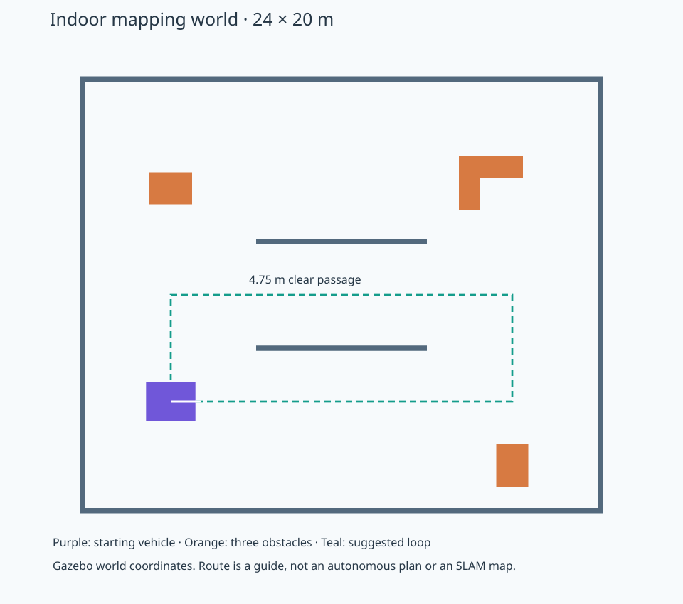

# 室内建图准备

本项目包含 Gazebo 室内场景与 SLAM Toolbox 建图流程。场景本身不是占据栅格地图；地图由 SLAM 根据雷达、里程计和 TF 实时生成。

## 场景



新文件：`workspace/navigation_base/worlds/indoor_mapping.sdf`。
原 `vehicle.world.sdf` 保留单墙雷达场景；两个场景已同步修正里程计子坐标系。新场景复用已验证的小车、雷达与物理插件，世界仍叫 `demo`，模型仍叫 `vehicle`，桥接与 TF 名称不变。

- 围墙内净尺寸 24×20 m，墙高 2.5 m，厚 0.25 m；没有屋顶。
- 中间两面 8 m 长隔墙形成净宽 4.75 m 的通道，两端开口。
- 小车外廓约 2.31×1.85 m；绕驱动轮轴中心原地转向的扫掠直径约 3.6 m。通道内仍应低速，先在两端开阔区域转向。
- 三个不对称障碍物：西北方矮方块、东南方长柜、东北方 L 形组合体；均有碰撞体和可见几何，1.8 m 高，高于雷达扫描平面。
- 出生位置 Gazebo 世界坐标 `(-8,-5)`，朝 +X。里程计起点仍为 `(0,0)`；两者不能直接混用。
- 推荐初次手动路线（世界坐标）：`(-8,-5) → (-8,0) → (8,0) → (8,-5) → (-8,-5)`。低速通过中间通道，从南侧返回起点。虚线路线只是驾驶参考，尚未做全路线碰撞测试或回环验证。

## 建图组件与镜像

原始 `robot-sim:lyrical-v1` 中没有 `slam_toolbox`、`nav2_map_server`。通过独立 Dockerfile 添加组件，避免改写已验证的基础镜像：

```bash
docker build -t robot-sim:lyrical-mapping-v2 -f docker/Dockerfile.mapping docker
```

如果是新克隆的项目，需要先按根目录 README 构建基础镜像。安装这两个组件不等于已经接通 SLAM 或 Nav2 导航。

## 启动与回退

关闭旧仿真后（先在 RViz 保存需要保留的显示调整）：

```bash
docker stop robot-sim-gui
./docker/start-navigation-base.sh mapping
```

如当前没有容器，跳过 `docker stop`。重新登录桌面后，先运行 `./docker/prepare-display.sh`。

回到原单墙场景：

```bash
docker stop robot-sim-gui
./docker/start-navigation-base.sh lidar
```

不传场景参数时也默认为 `lidar`。`mapping` 默认使用建图镜像，`lidar` 使用原镜像。高级诊断可通过 `ROBOT_IMAGE` 覆盖镜像选择。

## 启动 SLAM 与保存地图

启动 `mapping` 场景后，另开终端执行：

```bash
./docker/start-slam.sh
```

脚本在前台运行 SLAM Toolbox，可用 Ctrl+C 停止建图。每次仿真重启后需要重新启动它；当前不自动载入旧地图。`slam/mapper_params_online_async.yaml` 基于镜像内上游默认配置，使用仿真时间、`/scan` 和 `map → vehicle/odom → vehicle/base_link → vehicle/chassis → vehicle/lidar`。分辨率 0.05 m，地图更新间隔 2 秒，最小位移/转角 0.2 m / 0.2 rad。

`mapping` 场景自动加载 `slam/mapping.rviz`，Fixed Frame 为 `map`，Map 显示订阅 `/map`；SLAM 启动前暂时提示缺少 map 是预期行为。

只读检查地图及扫描时刻的完整 TF：

```bash
docker exec robot-sim-gui bash -lc 'source /opt/ros/lyrical/setup.bash; python3 /work/robot_ws/navigation_base/slam/check_slam.py'
```

保存当前占据栅格地图（自动使用时间戳命名，也可传入不重复的名字）：

```bash
./docker/save-map.sh
```

地图保存为宿主机 `workspace/maps/<名字>.yaml` 和 `.pgm`，该目录不纳入 Git。保存的是当前覆盖区域，可能不完整；这不保存可继续建图的 SLAM 位姿图。

可选运动回归：**只在室内场景初始出生位置运行**，小车会以最高 0.25 m/s、0.35 rad/s 绕 1 m 小方形一圈，回到起点附近后停止，并验证已知地图面积增长。不要与手动遥控同时运行。

```bash
docker exec robot-sim-gui bash -lc 'source /opt/ros/lyrical/setup.bash; python3 /work/robot_ws/navigation_base/slam/verify_slam_motion.py'
```

这项短程回归不代表整屋覆盖或回环优化质量验收。完成更大范围的低速建图、检查墙面与回环质量后，再开展 Nav2。

## 存储位置与镜像兼容性

本机 `/mnt/robot_disk` 为 `/dev/sdb2` ext4 数据盘。Docker `data-root` 为 `/mnt/robot_disk/docker-engine`，containerd `root` 为 `/mnt/robot_disk/containerd`；项目、配置、日志和地图也都在此盘。容器里的 `/opt/ros` 属于该数据盘上的镜像，不是宿主机 `/opt/ros`。宿主机未安装新的 ROS 软件包。

2026-10-03 首次实际启动发现旧建图镜像的 `std_msgs` 等库为 8 月构建，而 SLAM 为 9 月构建，触发 `has_buffer_fields_std_msgs__msg__Header` 未定义符号错误。RViz 加载 Map 显示时也出现 `service_msgs` 符号不兼容。`Dockerfile.mapping` 现先更新独立镜像内已安装的 ROS 包及其必要依赖，再安装建图组件，生成 v2；原 `robot-sim:lyrical-v1` 保留。仅运行 `ldd` 无缺失不足以验证运行时 ABI，须实际启动并检查 `/map`。

参考：[SLAM Toolbox](https://index.ros.org/p/slam_toolbox/)、[Nav2 Map Saver](https://docs.nav2.org/rolling/configuration_and_development/configuration_guide/core_servers/map_server/configuring_map_saver/)。

## 本次场景验收（2026-10-02）

- Gazebo SDF 校验通过。`gz_frame_id` 被校验器标记为扩展元素，运行时仍正确输出 `vehicle/lidar`。
- 对比原场景，小车模型与雷达配置仅出生位置不同，原单墙场景未改动。
- 原镜像运行新场景的数据检查通过：360 束激光、283 束有限有效返回，最近约 3.849 m；里程计和雷达 TF 正常。
- 用户已确认四周围墙、中间通道、三个障碍物显示正常。
- 推荐路线的静态几何采样检查：最小障碍距离 2.0 m；仍需后续低速实车模型驾驶验证。
- 本阶段没有运行 SLAM，也没有生成或保存地图。

只读数据复验命令（不驱动车辆）：

```bash
docker exec robot-sim-gui bash -lc 'source /opt/ros/lyrical/setup.bash; python3 /work/robot_ws/navigation_base/check_mapping_scene.py'
```

建图镜像已完成构建并检查：`slam_toolbox 2.10.0`、`nav2_map_server 1.5.1`；异步建图节点和 `map_saver_cli` 的动态库无缺失。切换到旧 `robot-sim:lyrical-mapping-v1` 后，以上扫描、里程计、时钟和 TF 检查再次通过（仍为 360 束、283 束有效返回）。构建及两轮运行验证日志保存在本地 `logs/`，不纳入 Git。


## 2026-10-03 SLAM 接入与验收

- 建图镜像为 `robot-sim:lyrical-mapping-v2`；基础镜像未改写。
- 已实际启动 SLAM 生命周期节点至 `active`，验证非空 `/map`（有空闲与障碍栅格）及扫描时刻的 `map → vehicle/lidar` TF。
- 首轮 2 m 方形短程回归通过：已知栅格从 1,096 增至 66,280；返回里程计起点附近（约 0.079 m），线速度和角速度最终均为 0。
- 首轮地图保存为 `workspace/maps/indoor-slam-20261003.yaml` 与 `.pgm`。地图只覆盖短程扫描区域，不代表整屋建图完成。
- RViz 已目视检查，Global Status 和 Map 均为 OK。第一次创建地图纹理时出现一次 GLSL sampler 日志，后续仍正常显示；类似现象见 [RViz 官方 issue #463](https://github.com/ros2/rviz/issues/463)。
- 宿主机 NVIDIA 595.91.07 的 `libGLX_nvidia` 依赖 `libnvidia-gpucomp`；当前 Toolkit 在只请求 `graphics,utility,display` 时没有挂载后者，导致软件渲染。启动脚本加入 `compute`，已在容器内确认 OpenGL vendor 为 NVIDIA、renderer 为 GTX 1650。此修复只改变容器驱动库挂载，不安装宿主机驱动。
- 本机安装、镜像、日志和地图都位于 `/mnt/robot_disk`。所有原有未提交的场景改动均保留，没有自动提交 Git。

硬件加速复测同样通过：已知栅格 1,096 → 65,999，最终地图 347×400、0.05 m/格，包含 63,143 个空闲栅格、2,856 个障碍栅格；返回起点附近约 0.079 m 后停止。最终地图为 `workspace/maps/indoor-slam-gpu-20261003.yaml` 与 `.pgm`。Gazebo 服务端、GUI 与 RViz 均出现在 NVIDIA GPU 进程列表。当前保留仿真与 SLAM 运行，可继续手动建图。随后用户截图证实 GPU 界面实际黑屏，之前将其归因于截屏的判断有误。当前只对 Gazebo GUI 与 RViz 设置 Mesa 软件渲染；服务端继续使用 GPU 雷达。两类界面均已确认可见。


## 显示与停车修复（同日）

- `bringup.launch.py` 的 `gui_software=1`、`gui_gl_vendor=mesa` 只影响两个 GUI 进程，避免当前 NVIDIA/Xwayland 黑屏；Gazebo 服务端不继承这些覆盖项。
- 原演示脚本中断时 rclpy 自动关闭上下文，导致 finally 中的零速度发送失败，Gazebo 保持上一条速度。这一缺陷已复现并修复：信号处理先结束控制循环，保持 ROS 上下文有效，发送零速度后才关闭。
- 新增 `velocity_guard.py`：公开 `/model/vehicle/cmd_vel` 先进入保护节点，保护输出 `/model/vehicle/cmd_vel_safe` 经桥接送到 Gazebo 原速度话题。原来的命令入口仍可使用，但必须持续发布；0.5 秒无新指令就停车。
- 保护使用墙钟计时，不依赖仿真是否暂停；雷达超过 1.5 秒未更新、数据无效或任何方向检测到小于 1.9 m 的距离时停止全部运动。线速度限制 0.25 m/s，角速度限制 0.35 rad/s。1.9 m 是针对当前较大车体的保守停止半径，会在狭窄区域提前停下；这是停车保护，不是避障规划器。
- 保护进程退出时 launch 关闭整套仿真，避免失去保护后继续保持速度。
- 隔离容器中的 `tests/check_velocity_stop.py` 已验证：指令丢失、雷达过期、近障碍、保护进程正常终止，以及运动脚本 SIGINT 时先停车再关闭 ROS。测试必须在 `--network none` 容器运行，不能在真实仿真 ROS 域里注入测试扫描。

在真实界面复跑时，旧 2 m 路线在里程计约 (1.997, 1.870) m 处触发近障碍保护：最近回波 1.897 m，已验证线速度与角速度均为 0。随后中断脚本也正常完成停车，无 ROS 上下文失效错误。当前演示路线缩小为出生点附近的 1 m 方形，保留 1.9 m 停车阈值。

带保护的 1 m 方形实景复测已完成：4 个航点均到达，未触发近障碍停车，回到起点附近约 0.077 m 后线速度/角速度均为 0；已知地图栅格 1,096 → 45,068，最终地图/扫描时刻 TF 检查通过。结果见本地 `logs/slam-safe-small-motion.log`、`logs/slam-safe-small-final.json`；当前保持场景与 SLAM 运行，不继续自动驾驶。


## 运动真值对照与 TF 修正（2026-10-03）

短程地图增长和里程计返回起点不能证明物理运动正确。本次新增 `diagnostics/verify_ground_truth.py`，直接订阅 Gazebo 原生 `/world/demo/dynamic_pose/info`，把模型世界位姿与链接局部位置组合为真实轮轴/车身位置，并与 ROS 里程计及车身 TF 比较。控制仅使用里程计；真值只用于测量。每阶段停车等待 2.5 秒后比较位移，属于静止端点检验，并非时间同步的全轨迹精度测量。

发现 DiffDrive 计算的参考点是驱动轮轴中心，原先却标为 `vehicle/chassis`。两者沿车体 X 相差 0.7057095 m，约 90° 转弯后造成约 0.99 m 的车身位置错误。现在两个场景均使用 `vehicle/base_link` 作为 odom 子坐标系，增加 base_link → chassis 静态平移 `[-0.7057095, 0, 0.5]` m，SLAM base_frame 同步修改；物理轮径、轮距不变。

修正后实测（直行约 0.6 m、左转约 90°、转回、倒车返回）：

| 阶段 | 轮轴里程计位移误差 | 车身 TF 位移误差 | 朝向增量误差绝对值 |
|---|---:|---:|---:|
| 直行 | 2.30 mm | 2.30 mm | <0.001° |
| 左转 | 0.11 mm | 5.34 mm | 0.427° |
| 转回 | 0.17 mm | 5.33 mm | 0.419° |
| 倒车返回 | 0.96 mm | 0.96 mm | <0.001° |

四阶段通过 3 cm / 2° 阈值，最终里程计线速度和角速度均为零。原始结果为本地 `workspace/maps/motion-before.json`、`motion-after.json` 及各自 `.trace.json`。修正前的地图与此前验收记录保留作历史对照，不能作为修正后导航地图。当前仅完成短距离运动及 TF 验证，尚未验收整屋覆盖、闭环地图质量或 Nav2。

在初始出生位置、无其他控制器发布速度时复验：

```bash
docker exec robot-sim-gui bash -lc 'source /opt/ros/lyrical/setup.bash; python3 /work/robot_ws/navigation_base/diagnostics/verify_ground_truth.py --require-tf-consistency --output /work/robot_ws/maps/motion-recheck.json'
```

测试会自动运动，要求起始最近回波超过 2.5 m，过程中低于 2.0 m 或反馈过期则终止并发零速度；独立 velocity_guard 继续生效。修正后短程地图保存为 `workspace/maps/indoor-slam-tf-fixed-20261003.yaml` 与 `.pgm`，只是当前局部覆盖的快照，不包含可恢复的 SLAM 位姿图。

## 较大范围闭合路线（受监督测试）

`diagnostics/map_indoor_loop.py` 是针对固定场景的低速航点控制器，不是自动探索或避障规划器。必须从室内场景出生位姿启动，并保证无其他控制器发布速度。路线按轮轴的 Gazebo 世界坐标为 `(-7.4457,-5) → (-7.4457,0) → (6.7,0) → (6.7,-4.8) → (-7.4457,-4.8) → (-7.4457,-5)`，约 38.29 m。它使用里程计跟踪航点，Gazebo 真值只用于记录与验收。

理想几何路径采样的雷达最小间距为 2.175 m；以轮轴为圆心、1.8 m 半径包围车体的保守包络最小余量为 0.375 m。这些是理想路径的几何估算，不包含跟踪误差。实际控制最高 0.22 m/s、0.22 rad/s；最近回波低于 2.0 m 或反馈超过 1.5 秒未更新时停止退出，独立 1.9 m 保护仍保持。

```bash
docker exec robot-sim-gui bash -lc 'source /opt/ros/lyrical/setup.bash; python3 /work/robot_ws/navigation_base/diagnostics/map_indoor_loop.py --output /work/robot_ws/maps/indoor-loop-new.json'
```

保存地图后，可将观测到的障碍栅格与 SDF 内静态盒状障碍表面进行对照：

```bash
python3 workspace/navigation_base/diagnostics/assess_indoor_map.py workspace/maps/<名字>.yaml --world workspace/navigation_base/worlds/indoor_mapping.sdf
```

检查器允许一次小范围刚体配准来消除地图坐标原点差异，输出 `.quality.json` 和 `.quality.png`，报告障碍点到场景表面的中位数、95 分位距离及 15 cm 内占比。该指标不验证未观测区域、完整覆盖或自由空间正确性，不能独立作为导航验收。


### 38 m 路线实际结果（2026-10-03）

- 5 个航点全部完成，耗时约 725 秒（墙钟），最终线速度、角速度均为 0；最小观测雷达距离 2.194 m，没有触发停车阈值。
- 已知栅格由 13,086 增至 150,885；最终地图 484×405、0.05 m/格，其中空闲 147,592、障碍 3,293、未知 45,135。未知区域包含北侧隔墙与障碍背面遮挡，不能称为整屋完整地图。
- Gazebo 真值返回起点误差 0.230 m，朝向返回误差约 0.808°；地图中的起终点间距 0.248 m。该路线由轮式里程计控制，闭合航点不等于物理位置精确闭合。
- 在初始朝向对齐后，SLAM 起终点位移与真值位移相差约 0.018 m（静止端点比较）；没有单独验证 SLAM 内部回环约束是否被触发，不能据此宣称回环算法已全面验收。
- 障碍栅格相对已知静态场景的表面距离：名义坐标对齐时 95 分位为 0.118 m；允许一次刚体配准后，中位数 0.020 m、95 分位 0.047 m，全部观测障碍栅格在 0.15 m 内。配准为平移 (-7.4657175,-5.0) m、旋转 -0.344°。目视叠图未见明显大尺度重影；此指标不验证未知区域或自由空间。
- 最终 `/map` 与扫描时刻 TF 检查通过，仿真和 SLAM 保持运行，小车停止。

数据盘 `workspace/maps/indoor-loop-20261003` 下保存 `.yaml`、`.pgm`、`.png`、路线 `.json` 和 `.trace.json`、质量 `.quality.json` 与 `.quality.png`。另外保存 `.posegraph` 和 `.data`，服务返回成功且两个文件非空；本轮未进行重载恢复演练。旧地图全部保留。

后续保存可恢复的 SLAM 状态：

```bash
./docker/save-slam-state.sh <不重复的名字>
```

该脚本拒绝覆盖旧状态，并检查服务返回和文件存在性。它与 `save-map.sh` 的栅格地图保存互为补充。下一阶段优先补扫北侧遮挡区，再进行地图定位与 Nav2 目标导航测试。
