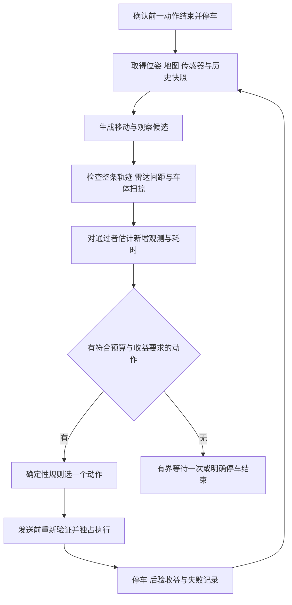

# 移动还是观察的决策设计

状态：原始设计稿，2026-10-04。随后已实现[有界循环与观察接口](bounded-exploration-agent.md)，以下未来式条目保留为完整设计目标，不能全部视为已交付。当前有限旋转/附近换位、扫掠、去重和规则/模型选择已实现；完整 bootstrap、processed-scan 证据、自动解封与严格重复对照仍未实现。实际接口、限制和验收以运行说明为准。

核心决定是：每次完成一个动作并确认停车后，同时评估短角度旋转、换到附近观察点和继续前往 frontier。先排除不可执行动作，再比较新增观测的代理收益与完整执行时间；用实际地图变化更新选择依据，限制重复低收益观察。

## 当前系统提供了什么

以下为仓库当前配置，不是新增设计参数。

| 项目 | 当前事实 | 对本设计的约束 |
|---|---|---|
| 雷达 | 360°，360 条水平采样，10 Hz 仿真时间，12 m 量程 | 不能把转 90°当成多看见 90°视场；旋转可能改变采样和偏置雷达位置，但不能穿透墙 |
| 雷达位置 | 当前 TF 平面偏置约为 `(-0.7057095, 0)` m | 原地转向时雷达绕转轴移动，必须预测其轨迹；执行时读取 TF |
| SLAM | 距离阈值 0.2 m、朝向阈值 0.2 rad，最小时间间隔 0.5 s，地图更新间隔 2 s | 静止等待不等于获得新关键帧；达到运动阈值也不保证扫描最终被接收 |
| 运动 | 导航最大线速度 0.22 m/s；Spin 最大角速度 0.25 rad/s | 90°旋转仅匀速部分就至少约 6.28 s 仿真时间，整圈约 25.13 s，另加加减速和反馈时间 |
| 安全 | guard 阈值 1.9 m；路径规划余量 0.25 m | 规划间距要求是 2.15 m，不能将 2.01 m 的候选列为可执行 |
| 既有探索 | `AggressiveMap.gain()` 用 90 条射线统计未知面积代理量 | 它只按一个位置评分，不是移动与旋转共同的增量收益模型 |
| 既有观察 | `Explorer.observe(seconds)` 只处理回调并检查健康；初始 Spin 是单独分支 | 当前尚无到点后的移动与观察联合决策，也没有观察收益反馈 |

1.881 m 是旧实验的实测雷达距离；原路径在归档最终地图中的预测下界约为 1.593 m。状态与接口必须分别标明地图预测、实时扫描及其时间戳，避免混用两类数值。

## 动作与执行语义

| 动作类型 | 候选生成 | 执行方式 | 成功的含义 |
|---|---|---|---|
| `ROTATE_OBSERVE` | 原地有符号的 ±45°、±90°；依据安全、重复记录与收益筛选 | Nav2 Spin，保留碰撞检查；随后有界等待地图反馈 | 转向完成、确认停车，另报观测收益是否有效 |
| `MOVE_OBSERVE` | 已知自由空间中的附近观察位姿；首版建议距离 0.5–1.5 m，兼顾遮挡边缘和不同观察方向 | Nav2 规划与导航，到达后有界等待反馈 | 到达观察位姿、停车，另报收益 |
| `NAVIGATE_FRONTIER` | 复用 frontier 候选产生器及路径预检 | Nav2 NavigateToPose，记录行进和到点后的观测 | 导航成功、停车，另报收益 |
| `SCAN_AROUND` | 首版仅在启动建图且尚未用过 bootstrap 配额时生成完整扫描候选 | 固定符号分段 Spin，每段后确认停车并重评估剩余动作 | 完成计划段，或因边际收益不足提前结束 |
| `WAIT_FOR_MAP` | 有动作后地图发布滞后的证据时，由执行器内部使用 | 零运动，有界等待 | 得到可比较反馈或返回 `FEEDBACK_INCOMPLETE` |
| `STOP` | 无可执行动作、预算耗尽、健康异常或持续 guard 阻止运动 | 取消活动任务并确认停车 | `stopped=true`，附明确终止原因 |

`MOVE_OBSERVE` 与 `NAVIGATE_FRONTIER` 是同一种导航能力的不同目的，不叠加两次信息收益。相近的终点和相同路径需要去重。0.5–1.5 m 的近处候选使用独立生成器，避免被当前激进策略的 1.2 m 最小距离直接过滤；它仍使用相同的 Nav2 和安全门。

第一版不生成未验证的后退、侧移或沿墙“试探速度”。执行器只接受已生成的 `option_id`，不会把任意角度、速度或 shell 命令作为模型入口。

## 一轮决策的顺序



快照含 `context_id`、地图内容及几何版本、map frame epoch、位姿及时间戳、雷达 TF、扫描新鲜度、当前任务和预算。所有候选绑定该快照。地图尺寸、分辨率、原点和坐标系变化也必须使版本失效，不能只比较栅格字节。

只有在 `IDLE` 时开始新一轮选动作。执行中的地图变化由执行器触发重查或取消；高层不能因另一个动作得分略高就不断抢占当前任务。

## 安全门

移动候选继续复用现有完整路径预检与运行时 guard。旋转候选必须补齐下列检查后，才能进入评分。

1. 从实际起始 yaw 和有符号旋转角生成完整角度序列，检查整个雷达轨迹的 2.15 m 规划间距。`+360°` 与 `0°` 的终点姿态相同，但轨迹不同；不能只传起终点让最短角插值折叠成零旋转。左右转是独立候选。
2. 检查车体完整 footprint 在所有中间朝向上的扫掠，禁止进入 occupied、unknown 或地图外。沿用导航 footprint 与 padding；检查配置来源，避免复制后不同步。可从现有 `AggressiveMap.is_safe()` 提取纯轮廓检查，但不能把终点检查直接当成全程通过。
3. 插值上界同时考虑雷达偏置半径和最远 footprint 顶点半径，使任一检查点的移动量不超过 0.05 m，并为点间扫掠保留保守余量。安全采样与信息估计采样分别配置。
4. 地图或 TF 改变后重新检查剩余有符号角度；执行中按现有 guard 规则处理扫描。读取不到 TF、反馈过期或无法确认停车时拒绝继续。

当前 `PathSafety.evaluate()` 能检查给定姿态序列中的雷达轨迹，但没有提供完整车体旋转扫掠验证；`Explorer.execute()` 的地图路径重查目前只适用于 `navigation`。这两处必须补齐，不能声称新增 Spin 已自动获得同等在线检查。

当前扫描低于 1.9 m 时，guard 同时阻止平移与旋转。此时返回 `guard_blocked_no_safe_motion`，不能以“观察”名义继续 Spin。高收益不能抵消安全失败；发送动作时重新调用安全检查，模型给出的旧 `safe=true` 不构成授权。

## 如何估计新增观测

首版使用可解释的“新增可见未知面积代理量”，字段命名为 `novel_unknown_area_proxy_m2`。它不等同于标定后的期望信息增益、熵下降或定位质量。

对同一个地图快照，定义 `V(q)` 为机器人在姿态 q 时，从真实雷达位置向外射线能触及的未知格集合。射线到已知非自由格即停止，最大预测距离先沿用 8 m，累计进入未知的深度最多 2 m；这是乐观代理量，未知区内部仍可能有遮挡。

几何收益采用统一的地图方向射线格，而非随 yaw 转动一个稀疏射线格。对 360°雷达，若偏置为零且位置不变，理想几何可见集合应与 yaw 无关。实际离散光束补采样可能产生收益，但首版不凭一个随朝向变化的采样误差奖励旋转。

对动作 a 沿途预测姿态集合 Q(a)：

```text
baseline = V(current_pose) ∪ recent_view_sets
visible_after_action = union(V(q) for q in Q(a))
novel_cells(a) = visible_after_action - baseline
G_proxy(a) = cell_area × count(novel_cells(a))
```

`recent_view_sets` 必须在当前地图快照上重算，只保留同一 map frame epoch 下最近的有效观察位姿。建议首版保留最近 8 个位姿。跨地图版本的行列编号不能直接做集合差；SLAM 坐标跳变时清空局部收益缓存。所有沿途和到点可见集合取并集，避免把同一未知格按每次扫描重复计分。

信息采样可先按约 0.2 m 平移或 0.2 rad 转角抽取姿态，并过滤不满足预计扫描时间间隔的密集样本。这些值来自 SLAM 运动阈值，只是预测采样尺度，不能据此断言扫描一定进入 SLAM。

旋转收益主要来自偏置雷达换位后新出现的可见集合。对“旋转能增加关键帧”的判断，仅作为有上限的探索性观察理由；没有 processed-scan 证据时，不把它添加成一个虚构的面积奖励。

第一次启动时，地图与历史观测可能不足以预测收益。允许显式 `bootstrap_observation`：在安全门通过后先转一段并测量，再决定是否继续，最多累计 360°。它消耗正常时间预算，结果独立记录。各对照策略必须采用相同的启动过程。

## 时间成本与选择规则

首版建议以仿真秒比较动作的地图收益率，墙钟时间负责资源预算和 watchdog。实际部署到硬件时二者趋于一致；在低实时因子的仿真中不能把它们混为一谈。

以下初值均为待标定的设计参数，不能冒充实测速度：

```text
v_effective = 0.15 m/s
omega_effective = 0.20 rad/s
settle_estimate = 4.0 simulation seconds
T_sim(a) = path_length / v_effective
           + absolute_turn_budget / omega_effective
           + settle_estimate
score(a) = G_proxy(a) / T_sim(a)
```

转角预算包括起步对齐、沿途转向和到点最终转向；使用展开的有符号角度累积绝对值。完整旋转为 2π。时间公式按串行运动保守估计，会高估一部分边走边转的时间，后续用不同动作类型的实测耗时标定，不直接乘以一个未经验证的加速系数。初始化、RPC 及处理延迟另计墙钟开销。

选择顺序如下：

1. 剔除安全失败、过期快照、空间失败排除、重复低收益动作，以及无法在剩余预算内执行和停车的候选。时间估计缺失时不能标成已验证可执行。
2. 在移动类与观察类中分别选收益率最高者。首版建议非启动动作至少有 0.25 m² 的预测增量；这个阈值需要回放与仿真标定。
3. 同时存在两类合格候选时，只有观察得分至少比最佳移动高 20% 才优先原地观察；否则移动。20% 是抑制估计噪声导致频繁观察的初始设计值。
4. 没有移动候选而有安全、有收益的观察候选时可以观察；两类都没有时，仅在有待发布反馈的证据时等待一次，随后明确结束。无候选不能被描述为探索完成。
5. 相同得分依次偏好执行时间更短、规划安全余量更大、稳定 ID 排序更靠前的候选。安全余量只在已通过安全门的集合中作平局选择。

示例是假设数据，只用于核对规则。下列四个候选的收益已经扣除当前视点与近期重复区域；完整机器可读内容见 [JSON 示例](examples/move-or-observe-context.json)。

| 候选 | 新增面积代理量 | 完整时间估计 | 预测最小雷达间距 | 结论 |
|---|---:|---:|---:|---|
| 原地左转 45° | 0.30 m² | 7.93 s | 2.45 m | 通过安全门，约 0.038 m²/s |
| 原地左转 90° | 0.40 m² | 11.85 s | 2.40 m | 通过安全门，约 0.034 m²/s |
| 换到 1.2 m 外观察点 | 6.00 m² | 19.85 s | 2.31 m | 通过安全门，约 0.302 m²/s，选择此动作 |
| 前往另一 frontier | 12.00 m² | 不进入评分 | 2.01 m | 低于 2.15 m，拒绝 |

如移动增量降到 0.50 m²而其余示例条件不变，移动收益率约 0.025 m²/s，45°观察收益率超过它的 1.2 倍，应改选观察。规则必须既能选择移动，也能在有证据时选择观察。

## 怎样测量实际收益

每个动作保存派发前地图、确认停车后的地图与有界等待结束后的地图。分别记录“整个动作窗口的地图增量”和“停车后等待窗口的增量”，不能把导航沿途看到的区域全部算成到点旋转的效果。

首版建议等候两个地图发布周期，最多 4 秒仿真时间，同时设置 20 秒墙钟硬上限；达到上限后结束等待并返回反馈状态。等待本身不触发新的旋转，也不会每次超时都重置预算。

地图格子按 map 坐标注册后，在可比较范围内计算 unknown→known 面积及 known→unknown 面积。相同几何网格可直接比较；地图边界扩张时将旧边界外视为未知。原点改变且仍在同一网格上时做精确索引平移；分辨率、旋转或 map frame epoch 改变时，首版将本次局部收益标为 `UNCOMPARABLE`，不把重采样伪差当成新增信息。

同一坐标系内的回环形变仍可能改变栅格内容。若识别到回环重优化、明显定位跳变或大范围既知格重写，将收益有效性降为 `UNCOMPARABLE`。第一版不能保证识别所有重优化，因此称为“动作窗口的已观测地图变化”，不声称严格因果收益。

结果分开保存：

- `execution_status`：`SUCCEEDED`、`CANCELED`、`ABORTED` 等原始执行语义；完成一个零收益旋转不等于动作失败。
- `gain_status`：`MEASURED`、`LOW_GAIN`、`FEEDBACK_INCOMPLETE`、`UNCOMPARABLE`。
- `observed_new_known_area_m2`、`observed_lost_known_area_m2`、`net_known_area_change_m2`：有比较依据时填写，否则为 null。
- `accepted_scan_evidence`：`CONFIRMED` 或 `UNAVAILABLE`。仅收到 `/scan` 或重复地图消息不能声称 SLAM 接收了新关键帧。

第一版最低限度可用地图更新与运动时间戳完成面积观测；SLAM 接收扫描的适配字段需要单独验证来源，在接口中允许缺失。反馈未证实时不得用“没有面积增长”推断环境没有可观察信息；应记录不确定性并结束本次等待。

若没有证据证明动作后的扫描已参与建图，即使收到了两份相同地图，也不能生成 `LOW_GAIN`，应返回 `FEEDBACK_INCOMPLETE`。适配层需要核验当前 SLAM 版本可提供的处理时间戳或关键帧事件语义，不能直接将 topic 到达计数用作处理确认；这项接口核验是观察执行器的实现任务。缺少该证据时，重复动作封锁与角度上限仍生效。

## 防止原地空转和反复碰保护

初始建议：实测新增已知面积不足 0.25 m²视为低收益；该门限需结合分辨率和地图噪声标定。只用有效、可比较的结果触发低收益规则。

- 同一位置 1 m 邻域内，刚完成的相同方向与角度选项不重复执行；候选 ID 变化或全图地图哈希变化不能清除这条记录。
- 同一邻域连续两次有效低收益观察后，封锁原地观察。普通观察在该邻域累计绝对旋转最多 π rad；启动扫描使用独立的 2π 上限，首版每个任务最多一次。
- 已完成的观察本身以及无关区域的地图更新不能解除封锁。至少离开该邻域，并获得新的局部可见集合或遮挡变化证据，才能重新生成观察选项；成功记录不等同于安全失败排除记录。
- `FEEDBACK_INCOMPLETE` 或 `UNCOMPARABLE` 不计成低收益，但会禁止立即重复同一动作；本轮只允许一次有界反馈等待，随后换到有证据的移动候选或停车。
- `GUARD_STOP`、轮廓扫掠失败或路径失效按现有安全失败规则记录并排除。地图变大或收益很高不能自动解禁。若扫描仍低于 1.9 m，直接停车结束本轮。
- `SCAN_AROUND` 以最多四个 90°阶段执行。第一个有效低收益阶段后重新比较移动；若不再占优就结束剩余阶段。所有阶段计入同一个动作预算与累计角度，取消后必须等待终态和停车。

这些规则只解决本任务中的有界动作选择。持久化的全局停止锁、跨客户端仲裁和网络重试幂等仍需要 Robot Skills 实现，不能把当前探索器的文件锁视为这些能力已经存在。

## 提供给技能层的契约

后续统一入口可以设计为 `get_decision_context()` 与 `execute_option(context_id, option_id, request_id)`。MCP 只转发结构化参数和结果；第一阶段普通 Python 策略调用同一接口，不依赖模型参与实时执行。

`get_decision_context()` 返回位姿和传感器时间戳、地图版本、候选、预计收益、耗时、安全结果、排除原因与最近动作。一个候选至少包含以下字段。

| 字段 | 语义 |
|---|---|
| `option_id`, `context_id`, `map_version`, `map_frame_epoch` | 标识当前快照内的具体动作；历史去重另用空间位置、类型与轨迹签名 |
| `type`, `target_pose`, `signed_angle_rad` | 导航使用位姿，观察使用有符号角度；角度为弧度 |
| `trajectory_signature`, `path_length_m`, `absolute_turn_budget_rad` | 同一个完整动作的几何与成本；整圈不能归零 |
| `novel_unknown_area_proxy_m2`, `gain_model`, `gain_confidence` | 面积代理量、算法版本和可信程度，不伪装成概率 |
| `estimated_sim_seconds`, `estimated_wall_seconds`, `time_model` | 两种时间分别表示；没有实测实时因子时墙钟估计可为 null |
| `safety.status`, `planning_required_m`, `predicted_min_clearance_m`, `body_sweep_checked` | 使用 `SAFE_KNOWN_MAP`、`UNSAFE`、`UNKNOWN`，后两者都不可执行 |
| `eligible`, `reason_codes`, `score` | 安全失败、过期或预算不满足者 score 为 null，不能参与排名 |

执行时在单个仲裁临界区内检查状态与 request ID，刷新反馈后重新验证地图、轨迹、轮廓和预算，通过才创建 action。已有活动任务返回 `BUSY`。相同 request ID 与相同请求返回同一 task ID；相同 ID 不同请求返回 `REQUEST_ID_CONFLICT`。状态不明的请求先查询，不能重复创建任务。

任务状态为 `ACCEPTED → RUNNING → STOPPING → SUCCEEDED / CANCELED / ABORTED`，并记录 `stopped`。动作结束但停车未确认时保持禁止派发，不能因 task result 到达就立即启动另一个动作。到达 `STOPPED_BY_OPERATOR` 后需要显式恢复，而不是由评分器自行恢复。

## 代码落点与实现顺序

建议在 `workspace/navigation_base/exploration/` 增加下列模块，先保持算法与 ROS 分离；这些文件在本次设计中尚未创建。

| 模块 | 职责 |
|---|---|
| `observation.py` | 有符号旋转轨迹、附近观察点、动作去重与候选生成 |
| `information_gain.py` | 雷达原点、可见未知集合、沿途并集与新颖性计算 |
| `decision.py` | 纯函数安全过滤、耗时、选择、低收益与重复规则 |
| `observation_metrics.py` | 地图几何对齐、收益有效性与动作窗口记录 |
| `path_safety.py` 扩展 | 可复用的旋转雷达轨迹检查及完整车体扫掠检查 |
| `explore.py` 集成 | 串行执行动作、取消、地图反馈等待与在线重查 |

先实现纯函数与下述反例回归，再接入一个默认关闭的 `--decision-policy joint-v1`。现有策略作为 guard 对齐后的移动基线保留。新增统一 `--max-actions` 和累计角度预算；`--max-goals` 继续只限制导航目标。两类计数及总时间上限共同约束任务，不能只靠导航计数限制观察循环。

当前 `observe(seconds)` 建议更名为 `wait_for_map_feedback`，避免与真正的观察技能混淆。初始 Spin 最终迁移到同一动作执行器，已有 `--initial-scan` 作为启动策略入口保留。先验收本地规则版，再提取 Robot Skills，最后适配 MCP；本设计不新增 OpenAI 调用。

## 验收场景

以下是待实施的验收，不是已通过的测试。

| 场景 | 必须观察到的行为 |
|---|---|
| 360°雷达在开阔已知区域，偏置为零 | 改 yaw 不凭几何面积模型产生虚假高收益；不反复原地旋转 |
| 有偏置且遮挡边缘附近 | 能因真实新可见集合选择一个安全旋转，左右方向分开评分 |
| 墙后未知区域 | 旋转不能获得穿墙收益；存在更好移动观察点时选择移动 |
| 旋转端点安全而中间雷达距离不足 | 在派发 Spin 前拒绝，1.9 m guard 保持不变 |
| 雷达间距足够而中间车体进入未知 | 轮廓扫掠检查拒绝 |
| ±360°与跨越 ±π | 验证方向、整个圆弧及非零耗时，不发生零角折叠 |
| 目标预测间距 2.01 m | 即使信息代理量最高也拒绝；返回规划要求 2.15 m |
| 两次有效低收益观察 | 封锁同一邻域观察，换有收益移动候选或明确停车 |
| SLAM 延迟、重复地图或坐标跳变 | 有界等待；反馈缺失或不可比较分别记录，不伪造增益或触发无限重试 |
| 旋转中新增障碍或地图变化 | 重查剩余轨迹；取消并确认停车；扫描低于阈值时独立 guard 兜底 |
| 相同 request ID 重试或并发动作 | 只创建一个任务；冲突与 BUSY 有明确结果 |
| 无安全高收益动作或预算耗尽 | 有界终止并 `stopped=true`，不能声称整屋探索完成 |

规则单测要包含一对只改变相对收益的场景，分别选出 MOVE_OBSERVE 与 ROTATE_OBSERVE，避免策略名为联合决策却永远只选一种动作。

在线对照使用三种策略：guard 对齐后的移动基线、安全检查后的固定到点观察、联合决策。三者使用相同世界、初始位姿、启动扫描、SLAM、Nav2、guard 与资源预算；固定观察策略也必须经过相同安全门。初期每组至少做 5 次配对重复，区分标定场景与保留场景。

报告共同仿真时长的已知面积、完整任务墙钟时间、总路径长度、累计转角、观察次数、低收益次数、取消与 guard_stop、最小扫描距离，以及每次动作预测与实测面积。用统一时间预算作主比较，导航目标数只作辅助上限。保留原始轨迹、地图快照、配置与源码哈希；整屋覆盖率仍需另有固定区域分母。实现与安全验收通过后，才能根据实测选择默认策略，不能预先声称探索效率提升。

## 本地依据

- `workspace/navigation_base/worlds/indoor_mapping.sdf`：雷达视场、采样和量程。
- `workspace/navigation_base/bringup.launch.py`：底盘与雷达 TF。
- `workspace/navigation_base/slam/mapper_params_online_async.yaml`：扫描与地图更新配置。
- `workspace/navigation_base/navigation/nav2.yaml`：速度限制、轮廓和导航参数。
- `workspace/navigation_base/exploration/aggressive.py`：现有收益代理与候选。
- `workspace/navigation_base/exploration/path_safety.py`、`workspace/navigation_base/safety_contract.py`：现有路径与 guard 契约。
- `workspace/navigation_base/exploration/explore.py`：动作、等待、失败排除与记录逻辑。
- `docs/guard-path-clearance.md`：已完成的第一阶段与证据边界。
